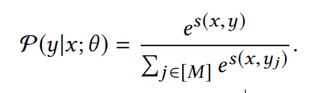
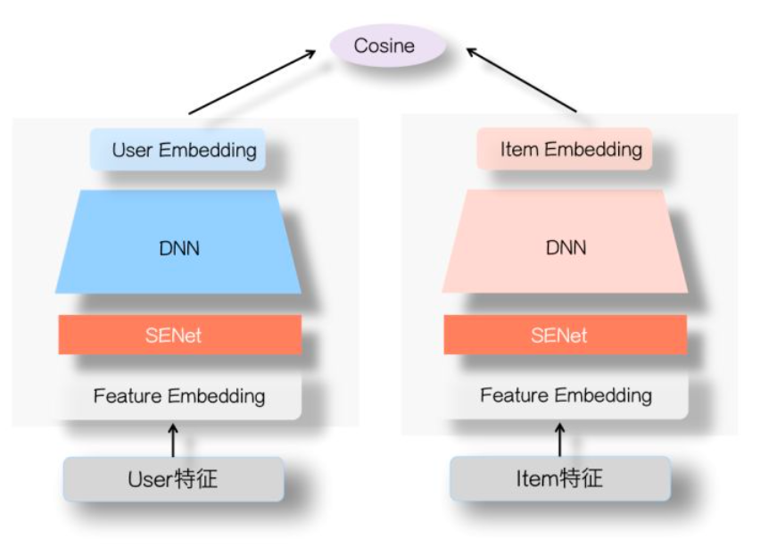
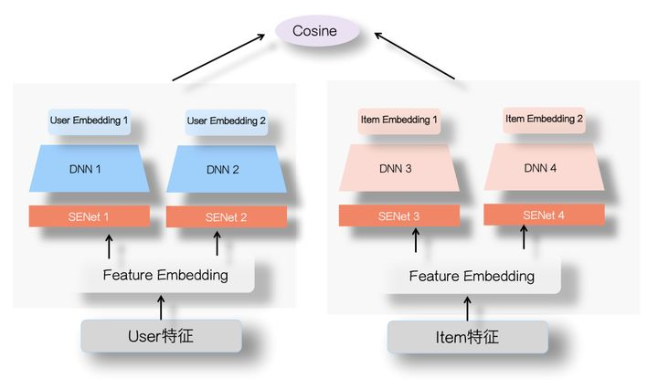
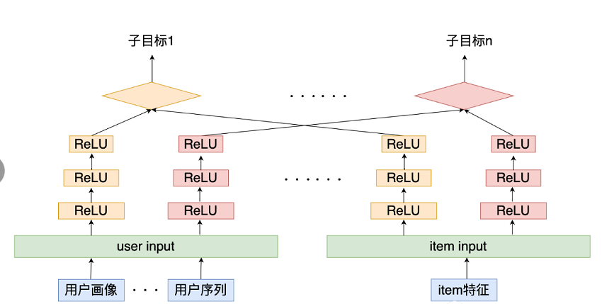

#  双塔召回模型

---

双塔模型在推荐领域中是一个十分经典的模型，无论是在召回还是粗排阶段，都会是首选。这主要是得益于双塔模型结构，使得能够在线预估时满足低延时的要求。但也是因为其模型结构的问题，使得无法考虑到user和item特之间的特征交叉，使得影响模型最终效果，因此很多工作尝试调整经典双塔模型结构，在保持在线预估低延时的同时，保证双塔两侧之间有效的信息交叉。下面针对于经典双塔模型以及一些改进版本进行介绍。


## 经典双塔模型

DSSM(Deep Structured Semantic Model)是由微软研究院于CIKM在2013年提出的一篇工作，该模型主要用来解决NLP领域语义相似度任务 ，利用深度神经网络将文本表示为低维度的向量，用来提升搜索场景下文档和query匹配的问题。DSSM 模型的原理主要是：通过用户搜索行为中query 和 doc 的日志数据，通过深度学习网络将query和doc映射到到共同维度的语义空间中，通过最大化query和doc语义向量之 间的余弦相似度，从而训练得到隐含语义模型，即 query 侧特征的 embedding 和 doc 侧特征的 embedding，进而可以获取语句的低维 语义向量表达 sentence embedding，可以预测两句话的语义相似度。模型结构如下所示：

<div align=center>
    
</div>


从上图可以看出，该网络结构比较简单，是一个由几层DNN组成网络，我们将要搜索文本(Query)和要匹配的文本(Document)的 embedding 输入到网络，网络输出为 128 维的向量，然后通过向量之间计算余弦相似度来计算向量之间距离，可以看作每一个 query 和 document 之间相似分数，然后在做 softmax。


而在推荐系统中，最为关键的问题是如何做好用户与item的匹配问题，因此对于推荐系统中DSSM模型的则是为 user 和 item 分别构建独立的子网络塔式结构，利用user和item的曝光或点击日期进行训练，最终得到user侧的embedding和item侧的embedding。因此在推荐系统中，常见的模型结构如下所示：

<div align=center>
    
</div>

从模型结构上来看，主要包括两个部分：user侧塔和item侧塔，对于每个塔分别是一个DNN结构。通过两侧的特征输入，通过DNN模块到user和item的embedding，然后计算两者之间的相似度(常用內积或者余弦值，下面会说这两种方式的联系和区别)，因此对于user和item两侧最终得到的embedding维度需要保持一致，即最后一层全连接层隐藏单元个数相同。


在召回模型中，将这种检索行为视为多类分类问题，类似于YouTubeDNN模型。将物料库中所有的item视为一个类别，因此损失函数需要计算每个类的概率值：

<div align=center>
    
</div>

其中$s(x,y)$表示两个向量的相似度，$P(y|x;\theta)$表示预测类别的概率，$M$表示物料库所有的item。但是在实际场景中，由于物料库中的item数量巨大，在计算上式时会十分的耗时，因此会采样一定的数量的负样本来近似计算，后面针对负样本的采样做一些简单介绍。


以上就是推荐系统中经典的双塔模型，之所以在实际应用中非常常见，是因为**在海量的候选数据进行召回的场景下，速度很快，效果说不上极端好，但一般而言效果也够用了**。之所以双塔模型在服务时速度很快，是因为模型结构简单(两侧没有特征交叉)，但这也带来了问题，双塔的结构无法考虑两侧特征之间的交互信息，**在一定程度上牺牲掉模型的部分精准性**。例如在精排模型中，来自user侧和item侧的特征会在第一层NLP层就可以做细粒度的特征交互，而对于双塔模型，user侧和item侧的特征只会在最后的內积计算时发生，这就导致很多有用的信息在经过DNN结构时就已经被其他特征所模糊了，因此双塔结构由于其结构问题先天就会存在这样的问题。下面针对这个问题来看看一下现有模型的解决思路。


## SENet双塔模型

SENet由Momenta在2017年提出，当时是一种应用于图像处理的新型网络结构。后来张俊林大佬将SENet引入了精排模型[FiBiNET](https%3A//arxiv.org/abs/1905.09433)中，其作用是为了将大量长尾的低频特征抛弃，弱化不靠谱低频特征embedding的负面影响，强化高频特征的重要作用。那SENet结构到底是怎么样的呢，为什么可以起到特征筛选的作用？

<div align=center>
    
</div>

从上图可以看出SENET主要分为三个步骤Squeeze, Excitation, Re-weight：

- Squeeze阶段：我们对每个特征的Embedding向量进行数据压缩与信息汇总，即在Embedding维度计算均值：

  ​                                                                  $$z_i = F_{sq}(e_i) = \frac{1}{k} \sum_{t=1}^k e_i^{(t)}$$

  其中k表示Embedding的维度，Squeeze阶段是将每个特征的Squeeze转换成单一的数值。

- Excitation阶段：这阶段是根据上一阶段得到的向量进行缩放，即将上阶段的得到的 $1 \times f$ 的向量$Z$先压缩成 $1 \times \frac{f}{r}$ 长度，然后在放回到  $1 \times f$ 的维度，其中$r$表示压缩的程度。这个过程的具体操作就是经过两层DNN。

  ​                                                                  $$A = F_{ex}(Z) = \sigma_2(W_2\sigma_1(W_1Z)) $$

  该过程可以理解为：对于当前所有输入的特征，通过相互发生关联，来动态地判断哪些特征重要，哪些特征不重要，而这体现在Excitation阶段的输出结果 $A$，其反应每个特征对应的重要性权重。

- Re-weight阶段：是将Excitation阶段得到的每个特征对应的权重 $A$ 再乘回到特征对应的Embedding里，就完成了对特征重要性的加权操作。

​																		$$V=F_{ReWeight }(A,E)=[a_1 \cdot e_1,⋯,a_f \cdot e_f]=[v_1,⋯,v_f]$$

以上简单的介绍了一下SENet结构，可以发现这种结构可以通过对特征embedding先压缩，再交互，再选择，进而实现特征选择的效果。


此外张俊林大佬还将SENet应用于双塔模型中[(SENet双塔模型：在推荐领域召回粗排的应用及其它)](https://zhuanlan.zhihu.com/p/358779957)，模型结构如下所示：

<div align=center>
    
</div>

从上图可以发现，具体地是将双塔中的user塔和Item侧塔的特征输入部分加上一个SENet模块，通过SENet网络，动态地学习这些特征的重要性，通过小权重抑制噪音或者无效低频特征，通过大权重放大重要特征影响的目的。


之所以SENet双塔模型是有效的呢？张俊林老师的解释是：双塔模型的问题在于User侧特征和Item侧特征交互太晚，在高层交互，会造成细节信息，也就是具体特征信息的损失，影响两侧特征交叉的效果。而SENet模块在最底层就进行了特征的过滤，使得很多无效低频特征即使被过滤掉，这样更多有用的信息被保留到了双塔的最高层，使得两侧的交叉效果很好；同时由于SENet模块选择出更加重要的信息，使得User侧和Item侧特征之间的交互表达方面增强了DNN双塔的能力。


因此SENet双塔模型主要是从特征选择的角度，提高了两侧特征交叉的有效性，减少了噪音对有效信息的干扰，进而提高了双塔模型的效果。此外，除了这样的方式，还可以通过增加通道的方式来增强两侧的信息交互。即对于user和item两侧不仅仅使用一个DNN结构，而是可以通过不同结构(如FM，DCN等)来建模user和item的自身特征交叉，例如下图所示：

<div align=center>
    
</div>


 这样对于user和item侧会得到多个embedding，类似于多兴趣的概念。通过得到的多个user和item的embedding，然后分别计算余弦值再相加(两侧的Embedding维度需要对齐)，进而增加了双塔两侧的信息交互。而这种方法在腾讯进行过尝试，他们提出的“并联”双塔就是按照这样的思路，感兴趣的可以了解一下。


## 多目标的双塔模型

现如今多任务学习在实际的应用场景也十分的常见，主要是因为实际场景中业务复杂，往往有很多的衡量指标，例如点击，评论，收藏，关注，转发等。在多任务学习中，往往会针对不同的任务使用一个独有的tower，然后优化不同任务损失。那么针对双塔模型应该如何构建多任务学习框架呢？

<div align=center>
    
</div>

如上图所示，在user侧和item侧分别通过多个通道(DNN结构)为每个任务得到一个user embedding和item embedding，然后针对不同的目标分别计算user 和 item 的相似度，并计算各个目标的损失，最后的优化目标可以是多个任务损失之和，或者使用多任务学习中的动态损失权重。


这种模型结构，可以针对多目标进行联合建模，通过多任务学习的结构，一方面可以利用不同任务之间的信息共享，为一些稀疏特征提供其他任务中的迁移信息，另一方面可以在召回时，直接使用一个模型得到多个目标预测，解决了多个模型维护困难的问题。也就是说，在线上通过这一个模型就可以同时得到多个指标，例如视频场景，一个模型就可以直接得到点赞，品论，转发等目标的预测值，进而通过这些值计算分数获得最终的Top-K召回结果。


## 双塔模型的细节

关于双塔模型，其模型结构相比排序模型来说很简单，没有过于复杂的结构。但除了结构，有一些细节部分容易被忽视，而这些细节部分往往比模型结构更加重要，因此下面主要介绍一下双塔模型中需要主要的一些细节问题。


### 归一化与温度系数

在[Google的双塔召回模型](https://dl.acm.org/doi/pdf/10.1145/3298689.3346996)中，重点介绍了两个trick，将user和item侧输出的embedding进行归一化以及对于內积值除以温度系数，实验证明这两种方式可以取得十分好的效果。那为什么这两种方法会使得模型的效果更好呢？

- 归一化：对user侧和item侧的输入embedding，进行L2归一化

  ​                                                                                   $$u(x,\theta) \leftarrow = \frac{u(x,\theta)}{||u(x,\theta)||_2}$$

  ​                                                                                   $$v(x,\theta) \leftarrow = \frac{v(x,\theta)}{||v(x,\theta)||_2}$$

- 温度系数：在归一化之后的向量计算內积之后，除以一个固定的超参 $r$ ，论文中命名为温度系数。

  ​                                                                                   $$s(u,v) = \frac{<u(x,\theta), v(x,\theta)>}{r}$$

   那为什么需要进行上述的两个操作呢？

- 归一化的操作主要原因是因为向量点积距离是非度量空间，不满足三角不等式，而归一化的操作使得点击行为转化成了欧式距离。

  首先向量点积是向量对应位相乘并求和，即向量內积。而向量內积**不保序**，例如空间上三个点(A=(10,0),B=(0,10),C=(11,0))，利用向量点积计算的距离 dis(A,B) < dis(A,C)，但是在欧式距离下这是错误的。而归一化的操作则会让向量点积转化为欧式距离，例如 $user_{emb}$ 表示归一化user的embedding， $item_{emb}$ 表示归一化 item 的embedding，那么两者之间的欧式距离 $||user_{emb} - item_{emb}||$ 如下，	可以看出归一化的向量点积已转化成了欧式距离。

  $$||user_{emb} - item_{emb}||=\sqrt{||user_{emb}||^2+||item_{emb}||^2-2<user_{emb},item_{emb}>} = \sqrt{2-2<user_{emb},item_{emb}>}$$

  

  那没啥非要转为欧式距离呢？这是因为ANN一般是通过计算欧式距离进行检索，这样转化成欧式空间，保证训练和检索一致。


### 模型的应用

在实际的工业应用场景中，分为离线训练和在线服务两个环节。

- 在离线训练阶段，同过训练数据，训练好模型参数。然后将候选库中所有的item集合离线计算得到对应的embedding，并存储进ANN检索系统，比如faiss。为什么将离线计算item集合，主要是因为item的会相对稳定，不会频繁的变动，而对于用户而言，如果将用户行为作为user侧的输入，那么user的embedding会随着用户行为的发生而不断变化，因此对于user侧的embedding需要实时的计算。
- 在线服务阶段，正是因为用户的行为变化需要被即使的反应在用户的embedding中，以更快的反应用户当前的兴趣，即可以实时地体现用户即时兴趣的变化。因此在线服务阶段需要实时的通过拼接用户特征，输入到user侧的DNN当中，进而得到user embedding，在通过user embedding去 faiss中进行ANN检索，召回最相似的K个item embedding。

可以看到双塔模型结构十分的适合实际的应用场景，在快速服务的同时，还可以更快的反应用户即时兴趣的变化。


### 负样本采样

相比于排序模型而言，召回阶段的模型除了在结构上的不同，在样本选择方面也存在着很大的差异，可以说样本的选择很大程度上会影响召回模型的效果。对于召回模型而言，其负样本并不能和排序模型一样只使用展现未点击样本，因为召回模型在线上面临的数据分布是全部的item，而不仅仅是展现未点击样本。因此在离线训练时，需要让其保证和线上分布尽可能一致，所以在负样本的选择样要尽可能的增加很多未被曝光的item。下面简单的介绍一些常见的采样方法：

#### 全局随机采样

全局随机采样指：从全局候选item里面随机抽取一定数量item做为召回模型的负样本。这样的方式实现简单，也可以让模型尽可能的和线上保持一致的分布，尽可能的多的让模型对于全局item有区分的能力。例如YoutubeDNN算法。

但这样的方式也会存在一定的问题，由于候选的item属于长尾数据，即“八二定律”，也就是说少数热门物料占据了绝大多数的曝光与点击。因此存随机的方式只能让模型在学到粗粒度上差异，对一些尾部item并不友好。


#### 全局随机采样 + 热门打压

针对于全局随机采样的不足，一个直观的方法是针对于item的热度item进行打压，即对于热门的item很多用户可能会点击，需要进行一定程度的欠采样，使得模型更加关注一些非热门的item。  此外在进行负样本采样时，应该对一些热门item进行适当的过采样，这可以尽可能的让模型对于负样本有更加细粒度的区分。例如在word2vec中，负采样方法是根据word的频率，对 negative words进行随机抽样，降 低 negative words 量级。

之所以热门item做负样本时，要适当过采样，增加负样本难度。因为对于全量的item，模型可以轻易的区分一些和用户兴趣差异性很大的item，难点在于很难区分一些和用户兴趣相似的item。因此在训练模型时，需要适当的增加一些难以区分的负样本来提升模型面对相似item的分区能力。


#### Hard Negative增强样本

Hard Negative指的是选取一部分匹配度适中的item，能够增加模型在训练时的难度，提升模型能学习到item之间细粒度上的差异。至于 如何选取在工业界也有很多的解决方案。

例如Airbnb根据业务逻辑来采样一些hard negative （增加与正样本同城的房间作为负样本，增强了正负样本在地域上的相似性；增加与正样本同城的房间作为负样本，增强了正负样本在地域上的相似性，），详细内容可以查看[原文](https://www.kdd.org/kdd2018/accepted-papers/view/real-time-personalization-using-embeddings-for-search-ranking-at-airbnb)

例如百度和facebook依靠模型自己来挖掘Hard Negative，都是用上一版本的召回模型筛选出"没那么相似"的<user,item>对，作为额外负样本，用于训练下一版本召回模型。 详细可以查看[Mobius](http://research.baidu.com/Public/uploads/5d12eca098d40.pdf) 和 [EBR](https://arxiv.org/pdf/2006.11632.pdf)


#### Batch内随机选择负采样

基于batch的负采样方法是将batch内选择除了正样本之外的其它Item，做为负样本，其本质就是利用其他样本的正样本随机采样作为自己的负样本。这样的方法可以作为负样本的选择方式，特别是在如今分布式训练以及增量训练的场景中是一个非常值得一试的方法。但这种方法也存在他的问题，基于batch的负采样方法受batch的影响很大，当batch的分布与整体的分布差异很大时就会出现问题，同时batch内负采样也会受到热门item的影响，需要考虑打压热门item的问题。至于解决的办法，Google的双塔召回模型中给出了答案，想了解的同学可以去学习一下。


总的来说负样本的采样方法，不光是双塔模型应该重视的工作，而是所有召回模型都应该仔细考虑的方法。


## 代码实现

下面使用一点资讯提供的数据，实践一下DSSM召回模型。该模型的实现主要参考：DeepCtr和DeepMatch模块。

### 模型训练数据

1、数据预处理
   用户侧主要包含一些用户画像属性（用户性别，年龄，所在省市，使用设备及系统）；新闻侧主要包括新闻的创建时间，题目，所属 一级、二级类别，题片个数以及关键词。下面主要是对着两部分数据的简单处理：

   ```python
def proccess(file):
    if file=="user_info_data_5w.csv":
        data = pd.read_csv(file_path + file, sep="\t",index_col=0)
        data["age"] = data["age"].map(lambda x: get_pro_age(x))
        data["gender"] = data["gender"].map(lambda x: get_pro_age(x))

        data["province"]=data["province"].fillna(method='ffill')
        data["city"]=data["city"].fillna(method='ffill')

        data["device"] = data["device"].fillna(method='ffill')
        data["os"] = data["os"].fillna(method='ffill')
        return data

    elif file=="doc_info.txt":
        data = pd.read_csv(file_path + file, sep="\t")
        data.columns = ["article_id", "title", "ctime", "img_num","cate","sub_cate", "key_words"]
        select_column = ["article_id", "title_len", "ctime", "img_num","cate","sub_cate", "key_words"]

        # 去除时间为nan的新闻以及除脏数据
        data= data[(data["ctime"].notna()) & (data["ctime"] != 'Android')]
        data['ctime'] = data['ctime'].astype('str')
        data['ctime'] = data['ctime'].apply(lambda x: int(x[:10]))
        data['ctime'] = pd.to_datetime(data['ctime'], unit='s', errors='coerce')


        # 这里存在nan字符串和异常数据
        data["sub_cate"] = data["sub_cate"].astype(str)
        data["sub_cate"] = data["sub_cate"].apply(lambda x: pro_sub_cate(x))
        data["img_num"] = data["img_num"].astype(str)
        data["img_num"] = data["img_num"].apply(photoNums)
        data["title_len"] = data["title"].apply(lambda x: len(x) if isinstance(x, str) else 0)
        data["cate"] = data["cate"].fillna('其他')

        return data[select_column]
   ```

2、构造训练样本
   该部分主要是根据用户的交互日志中前6天的数据作为训练集，第7天的数据作为测试集，来构造模型的训练测试样本。

   ```python
def dealsample(file, doc_data, user_data, s_data_str = "2021-06-24 00:00:00", e_data_str="2021-06-30 23:59:59", neg_num=5):
    # 先处理时间问题
    data = pd.read_csv(file_path + file, sep="\t",index_col=0)
    data['expo_time'] = data['expo_time'].astype('str')
    data['expo_time'] = data['expo_time'].apply(lambda x: int(x[:10]))
    data['expo_time'] = pd.to_datetime(data['expo_time'], unit='s', errors='coerce')

    s_date = datetime.datetime.strptime(s_data_str,"%Y-%m-%d %H:%M:%S")
    e_date = datetime.datetime.strptime(e_data_str,"%Y-%m-%d %H:%M:%S") + datetime.timedelta(days=-1)
    t_date = datetime.datetime.strptime(e_data_str,"%Y-%m-%d %H:%M:%S")

    # 选取训练和测试所需的数据
    all_data_tmp = data[(data["expo_time"]>=s_date) & (data["expo_time"]<=t_date)]

    # 处理训练数据集  防止穿越样本
    # 1. merge 新闻信息，得到曝光时间和新闻创建时间； inner join 去除doc_data之外的新闻
    all_data_tmp = all_data_tmp.join(doc_data.set_index("article_id"),on="article_id",how='inner')

    # 发现还存在 ctime大于expo_time的交互存在  去除这部分错误数据
    all_data_tmp = all_data_tmp[(all_data_tmp["ctime"]<=all_data_tmp["expo_time"])]

    # 2. 去除与新闻的创建时间在测试数据时间内的交互  ()
    train_data = all_data_tmp[(all_data_tmp["expo_time"]>=s_date) & (all_data_tmp["expo_time"]<=e_date)]
    train_data = train_data[(train_data["ctime"]<=e_date)]

    print("有效的样本数：",train_data["expo_time"].count())

    # 负采样
    if os.path.exists(file_path + "neg_sample.pkl") and os.path.getsize(file_path + "neg_sample.pkl"):
        neg_samples = pd.read_pickle(file_path + "neg_sample.pkl")
        # train_neg_samples.insert(loc=2, column="click", value=[0] * train_neg_samples["user_id"].count())
    else:
        # 进行负采样的时候对于样本进行限制，只对一定时间范围之内的样本进行负采样
        doc_data_tmp = doc_data[(doc_data["ctime"]>=datetime.datetime.strptime("2021-06-01 00:00:00","%Y-%m-%d %H:%M:%S"))]
        neg_samples = negSample_like_word2vec(train_data, doc_data_tmp[["article_id"]].values, user_data[["user_id"]].values, neg_num=neg_num)
        neg_samples = pd.DataFrame(neg_samples, columns= ["user_id","article_id","click"])
        neg_samples.to_pickle(file_path + "neg_sample.pkl")

    train_pos_samples = train_data[train_data["click"] == 1][["user_id","article_id", "expo_time", "click"]]    # 取正样本

    neg_samples_df = train_data[train_data["click"] == 0][["user_id","article_id", "click"]]
    train_neg_samples = pd.concat([neg_samples_df.sample(n=train_pos_samples["click"].count()) ,neg_samples],axis=0)  # 取负样本

    print("训练集正样本数：",train_pos_samples["click"].count())
    print("训练集负样本数：",train_neg_samples["click"].count())

    train_data_df = pd.concat([train_neg_samples,train_pos_samples],axis=0)
    train_data_df = train_data_df.sample(frac=1)  # shuffle

    print("训练集总样本数：",train_data_df["click"].count())

    test_data_df =  all_data_tmp[(all_data_tmp["expo_time"]>e_date) & (all_data_tmp["expo_time"]<=t_date)][["user_id","article_id", "expo_time", "click"]]

    print("测试集总样本数：",test_data_df["click"].count())
    print("测试集总样本数：",test_data_df["click"].count())

    all_data_df =  pd.concat([train_data_df, test_data_df],axis=0)

    print("总样本数：",all_data_df["click"].count())

    return all_data_df
   ```

3、负样本采样
   该部分主要采用基于item的展现次数对全局item进行负采样。

   ```python
   def negSample_like_word2vec(train_data, all_items, all_users, neg_num=10):
    """
    为所有item计算一个采样概率，根据概率为每个用户采样neg_num个负样本，返回所有负样本对
    1. 统计所有item在交互中的出现频次
    2. 根据频次进行排序，并计算item采样概率（频次出现越多，采样概率越低，打压热门item）
    3. 根据采样概率，利用多线程为每个用户采样 neg_num 个负样本
    """
    pos_samples = train_data[train_data["click"] == 1][["user_id","article_id"]]

    pos_samples_dic = {}
    for idx,u in enumerate(pos_samples["user_id"].unique().tolist()):
        pos_list = list(pos_samples[pos_samples["user_id"] == u]["article_id"].unique().tolist())
        if len(pos_list) >= 30:  # 30是拍的  需要数据统计的支持确定
            pos_samples_dic[u] = pos_list[30:]
        else:
            pos_samples_dic[u] = pos_list

    # 统计出现频次
    article_counts = train_data["article_id"].value_counts()
    df_article_counts = pd.DataFrame(article_counts)
    dic_article_counts = dict(zip(df_article_counts.index.values.tolist(),df_article_counts.article_id.tolist()))

    for item in all_items:
        if item[0] not in dic_article_counts.keys():
            dic_article_counts[item[0]] = 0

    # 根据频次排序, 并计算每个item的采样概率
    tmp = sorted(list(dic_article_counts.items()), key=lambda x:x[1], reverse=True)  # 降序
    n_articles = len(tmp)
    article_prob = {}
    for idx, item in enumerate(tmp):
        article_prob[item[0]] = cal_pos(idx, n_articles)

    # 为每个用户进行负采样
    article_id_list = [a[0] for a in article_prob.items()]
    article_pro_list = [a[1] for a in article_prob.items()]
    pos_sample_users = list(pos_samples_dic.keys())

    all_users_list = [u[0] for u in all_users]

    print("start negative sampling !!!!!!")
    pool = multiprocessing.Pool(core_size)
    res = pool.map(SampleOneProb((pos_sample_users,article_id_list,article_pro_list,pos_samples_dic,neg_num)), tqdm(all_users_list))
    pool.close()
    pool.join()

    neg_sample_dic = {}
    for idx, u in tqdm(enumerate(all_users_list)):
        neg_sample_dic[u] = res[idx]

    return [[k,i,0] for k,v in neg_sample_dic.items() for i in v]
   ```

### DSSM 模型

1、模型构建

​	模型构建部分主要是将输入的user 特征以及 item 特征处理完之后分别送入两侧的DNN结构。

```python
def DSSM(user_feature_columns, item_feature_columns, dnn_units=[64, 32], 
        temp=10, task='binary'):
    # 构建所有特征的Input层和Embedding层
    feature_encode = FeatureEncoder(user_feature_columns + item_feature_columns)
    feature_input_layers_list = list(feature_encode.feature_input_layer_dict.values())

    # 特征处理
    user_dnn_input, item_dnn_input = process_feature(user_feature_columns,\
        item_feature_columns, feature_encode)

    # 构建模型的核心层
    if len(user_dnn_input) >= 2:
        user_dnn_input = Concatenate(axis=1)(user_dnn_input)
    else:
        user_dnn_input = user_dnn_input[0]
    if len(item_dnn_input) >= 2:
        item_dnn_input = Concatenate(axis=1)(item_dnn_input)
    else:
        item_dnn_input = item_dnn_input[0]
    user_dnn_input = Flatten()(user_dnn_input) 
    item_dnn_input = Flatten()(item_dnn_input)
    user_dnn_out = DNN(dnn_units)(user_dnn_input)
    item_dnn_out = DNN(dnn_units)(item_dnn_input)


    # 计算相似度
    scores = CosinSimilarity(temp)([user_dnn_out, item_dnn_out]) # (B,1)
    # 确定拟合目标
    output = PredictLayer()(scores)
    # 根据输入输出构建模型
    model = Model(feature_input_layers_list, output)
    return model 
```

2、CosinSimilarity相似度计算

​	在余弦相似度计算，主要是注意使用归一化以及温度系数的技巧。

```python
def call(self, inputs, **kwargs):
    """inputs 是一个列表"""
    query, candidate = inputs 
    # 计算两个向量的二范数
    query_norm = tf.norm(query, axis=self.axis) # (B, 1)
    candidate_norm = tf.norm(candidate, axis=self.axis)
    # 计算向量点击，即內积操作
    scores = tf.reduce_sum(tf.multiply(query, candidate), axis=-1)#(B,1)
    # 相似度除以二范数, 防止除零
    scores = tf.divide(scores, query_norm * candidate_norm + 1e-8)
    # 对score的范围限制到(-1, 1)之间
    scores = tf.clip_by_value(scores, -1, 1)
    # 乘以温度系数
    score = scores * self.temperature 
    return score 
```


### 模型训练

1、稀疏特征编码
   该部分主要是针对于用户侧和新闻侧的稀疏特征进行编码，并将训练样本join上两侧的特征。

   ```python
    # 数据和测试数据
    data, user_data, doc_data = get_all_data()

    # 1.Label Encoding for sparse features,and process sequence features with `gen_date_set` and `gen_model_input`
    feature_max_idx = {}
    feature_encoder = {}

    user_sparse_features = ["user_id", "device", "os", "province", "city", "age", "gender"]
    for feature in user_sparse_features:
        lbe = LabelEncoder()
        user_data[feature] = lbe.fit_transform(user_data[feature]) + 1
        feature_max_idx[feature] = user_data[feature].max() + 1
        feature_encoder[feature] = lbe


    doc_sparse_features = ["article_id", "cate", "sub_cate"]
    doc_dense_features = ["title_len", "img_num"]

    for feature in doc_sparse_features:
        lbe = LabelEncoder()
        if feature in ["cate","sub_cate"]:
            # 这里面会出现一些float的数据，导致无法编码
            doc_data[feature] = lbe.fit_transform(doc_data[feature].astype(str)) + 1
        else:
            doc_data[feature] = lbe.fit_transform(doc_data[feature]) + 1
        feature_max_idx[feature] = doc_data[feature].max() + 1
        feature_encoder[feature] = lbe

    data["article_id"] = feature_encoder["article_id"].transform(data["article_id"].tolist())
    data["user_id"] = feature_encoder["user_id"].transform(data["user_id"].tolist())


    # join 用户侧和新闻侧的特征
    data = data.join(user_data.set_index("user_id"), on="user_id", how="inner")
    data = data.join(doc_data.set_index("article_id"), on="article_id", how="inner")

    sparse_features = user_sparse_features + doc_sparse_features
    dense_features = doc_dense_features

    features = sparse_features + dense_features

    mms = MinMaxScaler(feature_range=(0, 1))
    data[dense_features] = mms.fit_transform(data[dense_features])
   ```

2、配置特征以及模型训练
   构建模型所需的输入特征，同时构建DSSM模型及训练。

   ```python
embedding_dim = 8
user_feature_columns = [SparseFeat('user_id', feature_max_idx['user_id'], embedding_dim),
                        SparseFeat("gender", feature_max_idx['gender'], embedding_dim),
                        SparseFeat("age", feature_max_idx['age'], embedding_dim),
                        SparseFeat("device", feature_max_idx['device'], embedding_dim),
                        SparseFeat("os", feature_max_idx['os'], embedding_dim),
                        SparseFeat("province", feature_max_idx['province'], embedding_dim),
                        SparseFeat("city", feature_max_idx['city'], embedding_dim),  ]

item_feature_columns = [SparseFeat('article_id', feature_max_idx['article_id'], embedding_dim),
                        DenseFeat('img_num', 1),
                        DenseFeat('title_len', 1),
                        SparseFeat('cate', feature_max_idx['cate'], embedding_dim),
                        SparseFeat('sub_cate', feature_max_idx['sub_cate'], embedding_dim)]

model = DSSM(user_feature_columns, item_feature_columns,
             user_dnn_hidden_units=(32, 16, embedding_dim), item_dnn_hidden_units=(32, 16, embedding_dim))  # FM(user_feature_columns,item_feature_columns)

model.compile(optimizer="adagrad", loss = "binary_crossentropy", metrics=[tf.keras.metrics.Recall(), tf.keras.metrics.Precision()] ) #

history = model.fit(train_model_input, train_label, batch_size=256, epochs=4, verbose=1, validation_split=0.2, )
   ```

3、生成embedding用于召回
   利用训练过的模型获取所有item的embeddings，同时获取所有测试集的user embedding，保存之后用于之后的召回工作。

   ```python
all_item_model_input = {"article_id": item_profile['article_id'].values,
                        "img_num": item_profile['img_num'].values,
                        "title_len": item_profile['title_len'].values,
                        "cate": item_profile['cate'].values,
                        "sub_cate": item_profile['sub_cate'].values,}

user_embedding_model = Model(inputs=model.user_input, outputs=model.user_embedding)
item_embedding_model = Model(inputs=model.item_input, outputs=model.item_embedding)

user_embs = user_embedding_model.predict(test_user_model_input, batch_size=2 ** 12)
item_embs = item_embedding_model.predict(all_item_model_input, batch_size=2 ** 12)

user_idx_2_rawid, doc_idx_2_rawid = {}, {}

for i in range(len(user_embs)):
    user_idx_2_rawid[i] = test_user_model_input["user_id"][i]

    for i in range(len(item_embs)):
        doc_idx_2_rawid[i] = all_item_model_input["article_id"][i]

        # 保存一份
        pickle.dump((user_embs, user_idx_2_rawid, feature_encoder["user_id"]), open(file_path + 'user_embs.pkl', 'wb'))
        pickle.dump((item_embs, doc_idx_2_rawid, feature_encoder["article_id"]), open(file_path + 'item_embs.pkl', 'wb'))
   ```


### ANN召回

1、为测试集用户召回
   通过annoy tree为所有的item构建索引，并通过测试集中所有的user embedding为每个用户召回一定数量的item。

   ```python
def get_DSSM_recall_res(user_embs, doc_embs, user_idx_2_rawid, doc_idx_2_rawid, topk):
    """近邻检索，这里用annoy tree"""
    # 把doc_embs构建成索引树
    f = user_embs.shape[1]
    t = AnnoyIndex(f, 'angular')
    for i, v in enumerate(doc_embs):
        t.add_item(i, v)
    t.build(10)

    # 每个用户向量， 返回最近的TopK个item
    user_recall_items_dict = collections.defaultdict(dict)
    for i, u in enumerate(user_embs):
        recall_doc_scores = t.get_nns_by_vector(u, topk, include_distances=True)
        # recall_doc_scores是(([doc_idx], [scores]))， 这里需要转成原始doc的id
        raw_doc_scores = list(recall_doc_scores)
        raw_doc_scores[0] = [doc_idx_2_rawid[i] for i in raw_doc_scores[0]]
        # 转换成实际用户id
        user_recall_items_dict[user_idx_2_rawid[i]] = dict(zip(*raw_doc_scores))

    # 默认是分数从小到大排的序， 这里要从大到小
    user_recall_items_dict = {k: sorted(v.items(), key=lambda x: x[1], reverse=True) for k, v in user_recall_items_dict.items()}

    pickle.dump(user_recall_items_dict, open(file_path + 'DSSM_u2i_dict.pkl', 'wb'))

    return user_recall_items_dict
   ```

2、测试召回结果
   为测试集用户的召回结果进行测试。

   ```python
user_recall_items_dict = get_DSSM_recall_res(user_embs, item_embs, user_idx_2_rawid, doc_idx_2_rawid, topk=TOP_NUM)

test_true_items = {line[0]:line[1] for line in test_set}

s = []
precision = []
for i, uid in tqdm(enumerate(list(user_recall_items_dict.keys()))):
    # try:
    pred = [x for x, _ in user_recall_items_dict[uid]]
    filter_item = None
    recall_score = recall_N(test_true_items[uid], pred, N=TOP_NUM)
    s.append(recall_score)
    precision_score = precision_N(test_true_items[uid], pred, N=TOP_NUM)
    precision.append(precision_score)
    print("recall", np.mean(s))
    print("precision", np.mean(precision))
   ```


## 参考

- [负样本为王：评Facebook的向量化召回算法](https://zhuanlan.zhihu.com/p/165064102)

- [多目标DSSM召回实战](https://mp.weixin.qq.com/s/aorZ43WozKrD2AudR6AnOg)

- [召回模型中的负样本构造](https://zhuanlan.zhihu.com/p/358450850)

- [Youtube双塔模型](https://dl.acm.org/doi/10.1145/3298689.3346996)

- [张俊林：SENet双塔模型：在推荐领域召回粗排的应用及其它](https://zhuanlan.zhihu.com/p/358779957)

- [双塔召回模型的前世今生（上篇）](https://zhuanlan.zhihu.com/p/430503952)

- [双塔召回模型的前世今生（下篇）](https://zhuanlan.zhihu.com/p/441597009)

- [Learning Deep Structured Semantic Models for Web Search using Clickthrough Data](https://www.microsoft.com/en-us/research/wp-content/uploads/2016/02/cikm2013_DSSM_fullversion.pdf)

  

  

