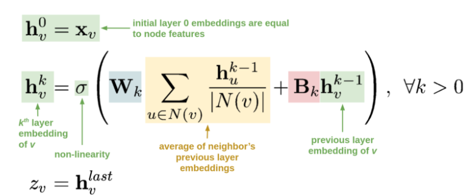
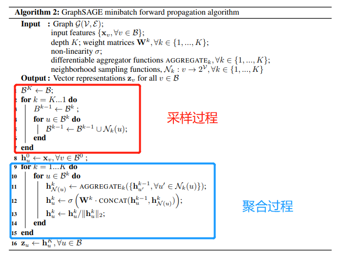
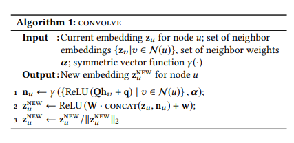
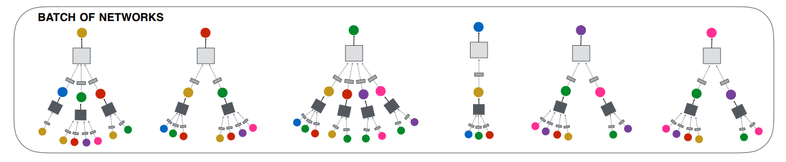
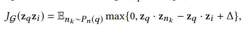
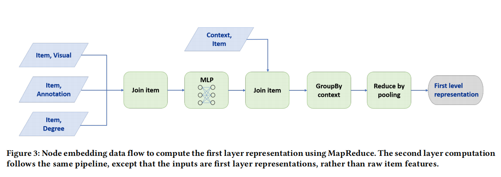

# Graph Convolutional Neural Networks for Web-Scale Recommender Systems

该论文是斯坦福大学和Pinterest公司与2018年联合发表与KDD上的一篇关于GCN成功应用于工业级推荐系统的工作。该论文提到的PinSage模型，是在GraphSAGE的理论基础进行了更改，以适用于实际的工业场景。下面将简单介绍一下GraphSAGE的原理，以及Pinsage的核心和细节。

## GraphSAGE原理

GraphSAGE提出的前提是因为基于直推式(transductive)学习的图卷积网络无法适应工业界的大多数业务场景。我们知道的是，基于直推式学习的图卷积网络是通过拉普拉斯矩阵直接为图上的每个节点学习embedding表示，每次学习是针对于当前图上所有的节点。然而在实际的工业场景中，图中的结构和节点都不可能是固定的，会随着时间的变化而发生改变。例如在Pinterest公司的场景下，每分钟都会上传新的照片素材，同时也会有新用户不断的注册，那么图上的节点会不断的变化。在这样的场景中，直推式学习的方法就需要不断的重新训练才能够为新加入的节点学习embedding，导致在实际场景中无法投入使用。

在这样的背景下，斯坦福大学提出了一种归纳(inductive)学习的GCN方法——GraphSAGE，即**通过聚合邻居信息的方式为给定的节点学习embedding**。不同于直推式(transductive)学习，GraphSAGE是通过学习聚合节点邻居生成节点Embedding的函数的方式，为任意节点学习embedding，进而将GCN扩展成归纳学习任务。

对于想直接应用GCN或者GraphSAGE的我们而言，不用非要去理解其背后晦涩难懂的数学原理，可以仅从公式的角度来理解GraphSAGE的具体操作。

<div align=center>
    
</div>

上面这个公式可以非常直观的让我们理解GraphSAGE的原理。

- $h_v^0$表示图上节点的初始化表示，等同于节点自身的特征。
- $h_v^k$表示第k层卷积后的节点表示，其来源于两个部分：
  - 第一部分来源于节点v的邻居节点集合$N(v)$，利用邻居节点的第k-1层卷积后的特征$h_u^{k-1}$进行 （ $\sum_{u \in N(v)} \frac{h_u^{k-1}}{|N(v)|}$ ）后，在进行线性变换。这里**借助图上的边将邻居节点的信息通过边关系聚合到节点表示中(简称卷积操作)**。
  - 第二部分来源于节点v的第k-1成卷积后的特征$h_v^{k-1}$，进行线性变换。总的来说图卷积的思想是**在对自身做多次非线性变换时，同时利用边关系聚合邻居节点信息。**
- 最后一次卷积结果作为节点的最终表示$Z_v$，以用于下游任务(节点分类，链路预测或节点召回)。

可以发现相比传统的方法(MLP，CNN，DeepWalk 或 EGES)，GCN或GraphSAGE存在一些优势：

1. 相比于传统的深度学习方法(MLP,CNN)，GCN在对自身节点进行非线性变换时，同时考虑了图中的邻接关系。从CNN的角度理解，GCN通过堆叠多层结构在图结构数据上拥有更大的**感受野**，利用更加广域内的信息。
2. 相比于图嵌入学习方法(DeepWalk，EGES)，GCN在学习节点表示的过程中，在利用节点自身的属性信息之外，更好的利用图结构上的边信息。相比于借助随机采样的方式来使用边信息，GCN的方式能从全局的角度利用的邻居信息。此外，类似于GraphSAGE这种归纳(inductive)学习的GCN方法，通过学习聚合节点邻居生成节点Embedding的函数的方式，更适用于图结构和节点会不断变化的工业场景。

在采样得到目标节点的邻居集之后，那么如何聚合邻居节点的信息来更新目标节点的嵌入表示呢？下面就来看看GraphSAGE中提及的四个聚合函数。

## GraphSAGE的采样和聚合

通过上面的公式可以知道，得到节点的表示主要依赖于两部分，其中一部分其邻居节点。因此对于GraphSAGE的关键主要分为两步：Sample采样和Aggregate聚合。其中Sample的作用是从庞大的邻居节点中选出用于聚合的邻居节点集合$N(v)$以达到降低迭代计算复杂度，而聚合操作就是如何利用邻居节点的表示来更新节点v的表示，已达到聚合作用。具体的过程如下伪代码所示：

<div align=center>
    
</div>

GraphSAGE的minibatch算法的思路是针对Batch内的所有节点，通过采样和聚合节点，为每一个节点学习一个embedding。

#### 邻居采样

GraphSAGE的具体采样过程是，首先根据中心节点集合$B^k$，对集合中每个中心节点通过随机采样的方式对其邻居节点采样固定数量S个(如果邻居节点数量大于S，采用无放回抽样；如果小于S，则采用有放回抽样)，形成的集合表示为$B^{k-1}$；以此类推每次都是为前一个得到的集合的每个节点随机采样S个邻居，最终得到第k层的所有需要参与计算的节点集合$B^{0}$。值得注意的有两点：**为什么需要采样并且固定采样数量S？** **为什么第k层所采样的节点集合表示为$B^0$？**

进行邻居采样并固定采样数量S主要是因为：1. 采样邻居节点避免了在全图的搜索以及使用全部邻居节点所导致计算复杂度高的问题；2. 可以通过采样使得部分节点更同质化，即两个相似的节点具有相同表达形式。3. 采样固定数量是保持每个batch的计算占用空间是固定的，方便进行批量训练。

第k层所采样的节点集合表示为$B^0$主要是因为：采样和聚合过程是相反的，即采样时我们是从中心节点组层进行采样，而聚合的过程是从中心节点的第k阶邻居逐层聚合得到前一层的节点表示。因此可以认为聚合阶段是：将k阶邻居的信息聚合到k-1阶邻居上，k-1阶邻居的信息聚合到k-2阶邻居上，....，1阶邻居的信息聚合到中心节点上的过程。

#### 聚合函数

如何对于采样到的节点集进行聚合，介绍的4种方式：Mean 聚合、Convolutional 聚合、LSTM聚合以及Pooling聚合。由于邻居节点是无序的，所以希望构造的聚合函数具有**对称性(即输出的结果不因输入排序的不同而改变)**，同时拥有**较强的表达能力**。

- Mean 聚合：首先会对邻居节点按照**element-wise**进行均值聚合，然后将当前节点k-1层得到特征$h_v^{k-1}$与邻居节点均值聚合后的特征 $MEAN(h_u^k | u\in N(v))$**分别**送入全连接网络后**相加**得到结果。
- Convolutional 聚合：这是一种基于GCN聚合方式的变种，首先对邻居节点特征和自身节点特征求均值，得到的聚合特征送入到全连接网络中。与Mean不同的是，这里**只经过一个全连接层**。

- LSTM聚合：由于LSTM可以捕捉到序列信息，因此相比于Mean聚合，这种聚合方式的**表达能力更强**；但由于LSTM对于输入是有序的，因此该方法不具备**对称性**。作者对于无序的节点进行随机排列以调整LSTM所需的有序性。
- Pooling聚合：对于邻居节点和中心节点进行一次非线性转化，将结果进行一次基于**element-wise**的**最大池化**操作。该种方式具有**较强的表达能力**的同时还具有**对称性**。

综上，可以发现GraphSAGE之所以可以用于大规模的工业场景，主要是因为模型主要是通过学习聚合函数，通过归纳式的学习方法为节点学习特征表示。接下来看看PinSAGE 的主要内容。

## PinSAGE 

### 背景

PinSAGE 模型是Pinterest 在GraphSAGE 的基础上实现的可以应用于实际工业场景的召回算法。Pinterest 公司的主要业务是采用瀑布流的形式向用户展现图片，无需用户翻页，新的图片会自动加载。因此在Pinterest网站上，有大量的图片(被称为pins)，而用户可以将喜欢的图片分类，即将pins钉在画板 boards上。可以发现基于这样的场景，pin相当于普通推荐场景中item，用户**钉**的行为可以认为是用于的交互行为。于是PinSAGE 模型主要应用的思路是，基于GraphSAGE 的原理学习到聚合方法，并为每个图片(pin)学习一个向量表示，然后基于pin的向量表示做**item2item的召回**。

可以知道的是，PinSAGE 是在GraphSAGE的基础上进行改进以适应实际的工业场景，因此除了改进卷积操作中的邻居采样策略以及聚合函数的同时还有一些工程技巧上的改进，使得在大数据场景下能更快更好的进行模型训练。因此在了解GraphSAGE的原理后，我们详细的了解一下本文的主要改进以及与GraphSAGE的区别。

### 重要性采样

在实际场景当中，一个item可能被数以百万，千万的用户交互过，所以不可能聚合所有邻居节点是不可行的，只可能是采样部分邻居进行信息聚合。但是如果采用GraphSAGE中随机采样的方法，由于采样的邻居有限(这里是相对于所有节点而言)，会存在一定的偏差。因此PinSAGE 在采样中考虑了更加重要的邻居节点，即卷积时只注重部分重要的邻居节点信息，已达到高效计算的同时又可以消除偏置。

PinSAGE使用重要性采样方法，即需要为每个邻居节点计算一个重要性权重，根据权重选取top-t的邻居作为聚合时的邻居集合。其中计算重要性的过程是，以目标节点为起点，进行random-walk，采样结束之后计算所有节点访问数的L1-normalized作为重要性权重，同时这个权重也会在聚合过程中加以使用(**加权聚合**)。

这里对于**计算权重之后如何得到top-t的邻居节点，**原文并没有直接的叙述。这里可以有两种做法，第一种就是直接采用重要权重，这种方法言简意赅，比较直观。第二种做法就是对游走得到的所有邻居进行随机抽样，而计算出的权重可以用于聚合阶段。个人理解第二种做法的可行性出于两点原因，其一是这样方法可以避免存在一些item由于权重系数低永远不会被选中的问题；其二可能并不是将所有重要性的邻居进行聚合更合理，毕竟重要性权重是通过随机采样而得到的，具有一定的随机性。当然以上两种方法都是可行的方案，可以通过尝试看看具体哪种方法会更有效。

### 聚合函数

PinSAGE中提到的Convolve算法（单层图卷积操作）相当于GraphSAGE算法的聚合过程，在实际执行过程中通过对每一层执行一次图卷积操作以得到不同阶邻居的信息，具体过程如下图所示：

<div align=center>
    
</div>

上述的单层图卷积过程如下三步：

1. 聚合邻居： 先将所有的邻居节点经过一次非线性转化(一层DNN)，再由聚合函数(Pooling聚合) $\gamma$（如元素平均，**加权和**等）将所有邻居信息聚合成目标节点的embedding。这里的加权聚合采用的是通过random-walk得到的重要性权重。
2. 更新当前节点的embedding：将目标节点当前的向量 $z_u$ 与步骤1中聚合得到的邻居向量 $n_u$ 进行拼接，在通过一次非线性转化。
3. 归一化操作：对目标节点向量 $z_u$ 归一化。

Convolve算法的聚合方法与GraphSAGE的Pooling聚合函数相同，主要区别在于对更新得到的向量 $z_u$ 进行归一化操作，**可以使训练更稳定，以及在近似查找最近邻的应用中更有效率。**

### 基于**mini-batch**堆叠多层图卷积

与GraphSAGE类似，采用的是基于mini-batch 的方式进行训练。之所以这么做的原因是因为什么呢？在实际的工业场景中，由于用户交互图非常庞大，无法对于所有的节点同时学习一个embedding，因此需要从原始图上寻找与 mini-batch 节点相关的子图。具体地是说，对于mini-batch内的所有节点，会通过采样的方式逐层的寻找相关邻居节点，再通过对每一层的节点做一次图卷积操作，以从k阶邻居节点聚合信息。

<div align=center>
    
</div>

如上图所示：对于batch内的所有节点(图上最顶层的6个节点)，依次根据权重采样，得到batch内所有节点的一阶邻居(图上第二层的所有节点)；然后对于所有一阶邻居再次进行采样，得到所有二阶邻居(图上的最后一层)。节点采样阶段完成之后，与采样的顺序相反进行聚合操作。首先对二阶邻居进行单次图卷积，将二阶节点信息聚合已更新一阶节点的向量表示(其中小方块表示的是一层非线性转化)；其次对一阶节点再次进行图卷积操作，将一阶节点的信息聚合已更新batch内所有节点的向量表示。仅此对于一个batch内的所有的样本通过卷积操作学习到一个embedding，而每一个batch的学习过程中仅**利用与mini-batch内相关节点的子图结构。**

### **训练过程**

PinSage在训练时采用的是 Margin Hinge Loss 损失函数，主要的思想是最大化正例embedding之间的相关性，同时还要保证负例之间相关性相比正例之间的相关性小于某个阈值(Margin)。具体的公式如下：

<div align=center>
    
</div>

其中$Z_p$是学习得到的目标节点embedding，$Z_i$是与目标节点相关item的embedding，$Z_{n_k}$是与目标节点不相关item的embedding，$\Delta$为margin值，具体大小需要调参。那么对于相关节点i，以及不相关节点nk，具体都是如何定义的，这对于召回模型的训练意义重大，让我们看看具体是如何定义的。

对于正样本而言，文中的定义是如果用户在点击的 item q之后立即点击了 item i，即认为 < q, i >构成正样本对。直观的我们很好理解这句话，不过在参考DGL中相关代码实现时，发现这部分的内容和原文中有一定的出入。具体地，代码中将所有的训练样本构造成用户-项目二部图，然后对batch内的每个 item q，根据item-user-item的元路径进行随机游走，得到被同一个用户交互过的 item i，因此组成<q,i>正样本对。对于负样本部分，相对来说更为重要，因此内容相对比较多，将在下面的负样本生成部分详细介绍。

这里还有一个比较重要的细节需要注意，由于模型是用于 item to item的召回，因此优化目标是与正样本之间的表示尽可能的相近，与负样本之间的表示尽可能的远。而图卷积操作会使得具有邻接关系的节点表示具有同质性，因此结合这两点，就需要在构建图结构的时，要将**训练样本之间可能存在的边在二部图上删除**，避免因为边的存在使得因卷积操作而导致的信息泄露。

### 工程技巧

由于PinSAGE是一篇工业界的论文，其中会涉及与实际工程相关的内容，这里在了解完算法思想之后，再从实际落地的角度看看PinSAGE给我们介绍的工程技巧。

**负样本的生成**

召回模型最主要的任务是从候选集合中选出用户可能感兴趣的item，直观的理解就是让模型将用户喜欢的和不喜欢的进行区分。然而由于候选集合的庞大数量，许多item之间十分相似，导致模型划分出来用户喜欢的item中会存在一些难以区分的item(即与用户非常喜欢item比较相似的那一部分)。因此对于召回模型不仅能区分用户喜欢和不喜欢的 item，同时还能区分与用户喜欢的 item 十分相似的那一部分item。那么如果做到呢？这主要是交给 easy negative examples 和 hard negative examples 两种负样本给模型学习。

- easy 负样本：这里对于mini-batch内的所有pair(训练样本对)会共享500负样本，这500个样本从batch之外的所有节点中随机采样得到。这么做可以减少在每个mini-batch中因计算所有节点的embedding所需的时间，文中指出这和为每个item采样一定数量负样本无差异。
- hard 负样本：这里使用hard 负样本的原因是根据实际场景的问题出发，模型需要从20亿的物品item集合中识别出最相似的1000个，即模型需要从2百万 item 中识别出最相似的那一个 item。也就是说模型的区分能力不够细致，为了解决这个问题，加入了一些hard样本。对于hard 负样本，应该是与 q 相似 以及和 i 不相似的物品，具体地的生成方式是将图上的节点计算相对节点 q 的个性化PageRank分值，根据分值的排序随机从2000~5000的位置选取节点作为负样本。

负样本的构建是召回模型的中关键的内容，在各家公司的工作都予以体现，具体的大家可以参考 Facebook 发表的[《Embedding-based Retrieval in Facebook Search》]([https://arxiv.org/pdf/2006.11632v1.pdf](https://links.jianshu.com/go?to=https%3A%2F%2Farxiv.org%2Fpdf%2F2006.11632v1.pdf))

**渐进式训练(Curriculum training)**

由于hard 负样本的加入，模型的训练时间加长（由于与q过于相似，导致loss比较小，导致梯度更新的幅度比较小，训练起来比较慢），那么渐进式训练就是为了来解决这个问题。

如何渐进式：先在第一轮训练使用easy 负样本，帮助模型先快速收敛(先让模型有个最基本的分辨能力)到一定范围，然后在逐步分加入hard负样本(方式是在第n轮训练时给每个物品的负样本集合增加n-1个 hard 负样本)，以调整模型细粒度的区分能力(让模型能够区分相似的item)。

**节点特征(side information)**

这里与EGES的不同，这里的边信息不是端到端训练得到，而是通过事前的预处理得到的。对于每个节点(即 pin)，都会有一个图片和一点文本信息。因此对于每个节点使用图片的向量、文字的向量以及节点的度拼接得到。这里其实也解释了为什么在图卷积操作时，会先进行一个非线性转化，其实就是将不同空间的特征进行转化(融合)。

**构建 mini-batch**

不同于常规的构建方式，PinSAGE中构建mini-batch的方式是基于生产者消费者模式。什么意思的，就是将CPU和GPU分开工作，让CPU负责取特征，重建索引，邻接列表，负采样等工作，让GPU进行矩阵运算，即CPU负责生产每个batch所需的所有数据，GPU则根据CPU生产的数据进行消费(运算)。这样由于考虑GPU的利用率，无法将所有特征矩阵放在GPU，只能存在CPU中，然而每次查找会导致非常耗时，通过上面的方式使得图卷积操作过程中就没有GPU与CPU的通信需求。

**多GPU训练超大batch**

前向传播过程中，各个GPU等分minibatch，共享一套模型参数；反向传播时，将每个GPU中的参数梯度都聚合到一起，同步执行SGD。为了保证因海量数据而使用的超大batchsize的情况下模型快速收敛以及泛化精度，采用warmup过程，即在第一个epoch中将学习率线性提升到最高，后面的epoch中再逐步指数下降。

**使用MapReduce高效推断**

在模型训练结束之后，需要为所有节点计算一个embedding，如果按照训练过程中的前向传播过程来生成，会存在大量重复的计算。因为当计算一个节点的embedding的时候，其部分邻居节点已经计算过了，同时如果该节点作为其他节点邻居时，也会被再次计算。针对这个问题，本文采用MapReduce的方法进行推断。该过程主要分为两步，具体如下图所示：

<div align=center>
    
</div>

1. 将item的embedding进行聚合，即利用item的图片、文字和度等信息的表示进行join(拼接)，在通过一层dense后得到item的低维向量。
2. 然后根据item来匹配其一阶邻居(join)，然后根据item进行pooling(其实就是GroupBy pooling)，得到一次图卷积操作。通过堆叠多次直接得到全量的embedding。

其实这块主要就是通过MapReduce的大数据处理能力，直接对全量节点进行一次运算得到其embedding，避免了分batch所导致的重复计算。

## 代码解析

了解完基本的原理之后，最关键的还是得解析源码，以证实上面讲的细节的准确性。下面基于DGL中实现的代码，看看模型中的一些细节。

###  数据处理

在弄清楚模型之前，最重要的就是知道送入模型的数据到底是什么养的，以及PinSAGE相对于GraphSAGE最大的区别就在于如何采样邻居，如何构建负样本等。

首先需要明确的是，无论是**邻居采样**还是**样本的构造**都发生在图结构上，因此最主要的是需要先构建一个user和item组成的二部图。

```python
# ratings是所有的用户交互
# 过滤掉为出现在交互中的用户和项目
distinct_users_in_ratings = ratings['user_id'].unique()
distinct_movies_in_ratings = ratings['movie_id'].unique()
users = users[users['user_id'].isin(distinct_users_in_ratings)]
movies = movies[movies['movie_id'].isin(distinct_movies_in_ratings)]

# 将电影特征分组 genres (a vector), year (a category), title (a string)
genre_columns = movies.columns.drop(['movie_id', 'title', 'year'])
movies[genre_columns] = movies[genre_columns].fillna(False).astype('bool')
movies_categorical = movies.drop('title', axis=1)

## 构建图
graph_builder = PandasGraphBuilder()
graph_builder.add_entities(users, 'user_id', 'user')  # 添加user类型节点
graph_builder.add_entities(movies_categorical, 'movie_id', 'movie')  # 添加movie类型节点

#  构建用户-电影的无向图
graph_builder.add_binary_relations(ratings, 'user_id', 'movie_id', 'watched')
graph_builder.add_binary_relations(ratings, 'movie_id', 'user_id', 'watched-by')

g = graph_builder.build()
```

在构建完原图之后，需要将交互数据(ratings)分成训练集和测试集，然后根据测试集从原图中抽取出与训练集中相关节点的子图。

```python
# train_test_split_by_time 根据时间划分训练集和测试集
# 将用户的倒数第二次交互作为验证，最后一次交互用作测试
# train_indices 为用于训练的用户与电影的交互
train_indices, val_indices, test_indices = train_test_split_by_time(ratings, 'timestamp', 'user_id')

# 只使用训练交互来构建图形，测试集相关的节点不应该出现在训练过程中。
# 从原图中提取与训练集相关节点的子图
train_g = build_train_graph(g, train_indices, 'user', 'movie', 'watched', 'watched-by')
```


### 正负样本采样

在得到训练图结构之后，为了进行PinSAGE提出的item2item召回任务，需要构建相应的训练样本。对于训练样本主要是构建正样本对和负样本对，前面我们已经提到了正样本对是基于 item to user to item的随即游走得到的；对于负样本DGL的实现主要是随机采样，即只有easy sample，未实现hard sample。具体地，DGL中主要是通过sampler_module.ItemToItemBatchSampler方法进行采样，主要代码如下：

```python
class ItemToItemBatchSampler(IterableDataset):
    def __init__(self, g, user_type, item_type, batch_size):
        self.g = g
        self.user_type = user_type
        self.item_type = item_type
        self.user_to_item_etype = list(g.metagraph()[user_type][item_type])[0]
        self.item_to_user_etype = list(g.metagraph()[item_type][user_type])[0]
        self.batch_size = batch_size

    def __iter__(self):
        while True:
            # 随机采样batch_size个节点作为head  即论文中的q
            heads = torch.randint(0, self.g.number_of_nodes(self.item_type), (self.batch_size,))
            
            # 本次元路径表示从item游走到user，再从user游走到item，总共二跳，取出二跳节点(电影节点)作为tails(即正样本)
            # 得到与heads被同一个用户消费过的其他item，做正样本
            # 这么做可能存在问题，
            #   1. 这种游走肯定会使正样本集中于少数热门item；
            #   2. 如果item只被一个用户消费过，二跳游走岂不是又回到起始item，这种case还是要处理的
            tails = dgl.sampling.random_walk(
                self.g,
                heads,
                metapath=[self.item_to_user_etype, self.user_to_item_etype])[0][:, 2]
            
            # 随机采样做负样本， 没有hard negative
            # 这么做会存在被同一个用户交互过的movie也会作为负样本
            neg_tails = torch.randint(0, self.g.number_of_nodes(self.item_type), (self.batch_size,))

            mask = (tails != -1)
            yield heads[mask], tails[mask], neg_tails[mask]
```

上面的样本采样过程只是一个简单的示例，如果面对实际问题，需要自己来重新完成这部分的内容。

### 邻居节点采样

再得到训练样本之后，接下来主要是在训练图上，为heads节点采用其邻居节点。在DGL中主要是通过sampler_module.NeighborSampler来实现，具体地，通过**sample_blocks**方法回溯生成各层卷积需要的block，即所有的邻居集合。其中需要注意的几个地方，基于随机游走的重要邻居采样，DGL已经实现，具体参考**[dgl.sampling.PinSAGESampler](https://link.zhihu.com/?target=https%3A//docs.dgl.ai/generated/dgl.sampling.PinSAGESampler.html%3Fhighlight%3Dpinsagesampler)**，其次避免信息泄漏，代码中，先将head → tails,head → neg_tails从frontier中先删除，再生成block。

```python
class NeighborSampler(object):  # 图卷积的邻居采样
    def __init__(self, g, user_type, item_type, random_walk_length, random_walk_restart_prob,
                 num_random_walks, num_neighbors, num_layers):
        self.g = g
        self.user_type = user_type
        self.item_type = item_type
        self.user_to_item_etype = list(g.metagraph()[user_type][item_type])[0]
        self.item_to_user_etype = list(g.metagraph()[item_type][user_type])[0]
        
        # 每层都有一个采样器，根据随机游走来决定某节点邻居的重要性(主要的实现已封装在PinSAGESampler中)
        # 可以认为经过多次游走，落脚于某邻居节点的次数越多，则这个邻居越重要，就更应该优先作为邻居
        self.samplers = [
            dgl.sampling.PinSAGESampler(g, item_type, user_type, random_walk_length,
                random_walk_restart_prob, num_random_walks, num_neighbors)
            for _ in range(num_layers)]

    def sample_blocks(self, seeds, heads=None, tails=None, neg_tails=None):
        """根据随机游走得到的重要性权重，进行邻居采样"""
        blocks = []
        for sampler in self.samplers:
            frontier = sampler(seeds) # 通过随机游走进行重要性采样，生成中间状态
            if heads is not None:
                # 如果是在训练，需要将heads->tails 和 head->neg_tails这些待预测的边都去掉
                eids = frontier.edge_ids(torch.cat([heads, heads]), torch.cat([tails, neg_tails]), return_uv=True)
                
                if len(eids) > 0:
                    old_frontier = frontier
                    frontier = dgl.remove_edges(old_frontier, eids)
            
            # 只保留seeds这些节点，将frontier压缩成block
            # 并设置block的input/output nodes
            block = compact_and_copy(frontier, seeds)
            
            # 本层的输入节点就是下一层的seeds
            seeds = block.srcdata[dgl.NID]
            blocks.insert(0, block)
        return blocks
```

其次**sample_from_item_pairs**方法是通过上面得到的heads, tails, neg_tails分别构建基于正样本对以及基于负样本对的item-item图。由heads→tails生成的pos_graph，用于计算pairwise loss中的pos_score，由heads→neg_tails生成的neg_graph，用于计算pairwise loss中的neg_score。

```python
class NeighborSampler(object):  # 图卷积的邻居采样
    def __init__(self, g, user_type, item_type, random_walk_length, ....):
        pass

    def sample_blocks(self, seeds, heads=None, tails=None, neg_tails=None):
        pass

    def sample_from_item_pairs(self, heads, tails, neg_tails):
        # 由heads->tails构建positive graph， num_nodes设置成原图中所有item节点
        pos_graph = dgl.graph(
            (heads, tails),
            num_nodes=self.g.number_of_nodes(self.item_type))

        # 由heads->neg_tails构建negative graph，num_nodes设置成原图中所有item节点
        neg_graph = dgl.graph(
            (heads, neg_tails),
            num_nodes=self.g.number_of_nodes(self.item_type))

        # 去除heads, tails, neg_tails以外的节点，将大图压缩成小图，避免与本轮训练不相关节点的结构也传入模型，提升计算效率
        pos_graph, neg_graph = dgl.compact_graphs([pos_graph, neg_graph])

        # 压缩后的图上的节点是原图中的编号
        # 注意这时pos_graph与neg_graph不是分开编号的两个图，它们来自于同一幅由heads, tails, neg_tails组成的大图
        # pos_graph和neg_graph中的节点相同，都是heads+tails+neg_tails，即这里的seeds，pos_graph和neg_graph只是边不同而已
        seeds = pos_graph.ndata[dgl.NID]  # 字典  不同类型节点为一个tensor，为每个节点的id值

        blocks = self.sample_blocks(seeds, heads, tails, neg_tails)
        return pos_graph, neg_graph, blocks
```


### PinSAGE

在得到所有所需的数据之后，看看模型结构。其中主要分为三个部分:**节点特征映射**，**多层卷积模块 **和 **给边打分**。

```python
class PinSAGEModel(nn.Module):
    def __init__(self, full_graph, ntype, textsets, hidden_dims, n_layers):
        super().__init__()
        # 负责将节点上的各种特征都映射成向量，并聚合在一起，形成这个节点的原始特征向量
        self.proj = layers.LinearProjector(full_graph, ntype, textsets, hidden_dims)
        # 负责多层图卷积，得到各节点最终的embedding
        self.sage = layers.SAGENet(hidden_dims, n_layers)
        # 负责根据首尾两端的节点的embedding，计算边上的得分
        self.scorer = layers.ItemToItemScorer(full_graph, ntype)

    def forward(self, pos_graph, neg_graph, blocks):
        """ pos_graph, neg_graph, blocks 的最后一层都对应batch中 heads+tails+neg_tails 这些节点
        """
        # 得到batch中heads+tails+neg_tails这些节点的最终embedding
        h_item = self.get_repr(blocks)
        # 得到heads->tails这些边上的得分
        pos_score = self.scorer(pos_graph, h_item)
        # 得到heads->neg_tails这些边上的得分
        neg_score = self.scorer(neg_graph, h_item)
        # pos_graph与neg_graph边数相等，因此neg_score与pos_score相减
        # 返回margin hinge loss，这里的margin是1 
        return (neg_score - pos_score + 1).clamp(min=0)

    def get_repr(self, blocks):
        """
        通过self.sage，经过多层卷积，得到输出节点上的卷积结果，再加上这些输出节点上原始特征的映射结果
        得到输出节点上最终的向量表示
        """
        h_item = self.proj(blocks[0].srcdata) # 将输入节点上的原始特征映射成hidden_dims长的向量
        h_item_dst = self.proj(blocks[-1].dstdata) # 将输出节点上的原始特征映射成hidden_dims长的向量
        return h_item_dst + self.sage(blocks, h_item)
```

**节点特征映射：**由于节点使用到了多种类型（int,float array,text）的原始特征，这里使用了一个DNN层来融合成固定的长度。

```python
class LinearProjector(nn.Module):
    def __init__(self, full_graph, ntype, textset, hidden_dims):
        super().__init__()
        self.ntype = ntype
        # 初始化参数,这里为全图中所有节点特征初始化
        # 如果特征类型是float，就定义一个nn.Linear线性变化为指定维度
        # 如果特征类型是int，就定义Embedding矩阵，将id型特征转化为向量
        self.inputs = _init_input_modules(full_graph, ntype, textset, hidden_dims)

    def forward(self, ndata):
        projections = []
        for feature, data in ndata.items():
            # NID是计算子图中节点、边在原图中的编号，没必要用做特征
            if feature == dgl.NID:
                continue
            module = self.inputs[feature]  # 根据特征名取出相应的特征转化器
            #  对文本属性进行处理 
            if isinstance(module, (BagOfWords, BagOfWordsPretrained)):
                length = ndata[feature + '__len']  
                result = module(data, length)
            else:
                result = module(data)   # look_up
            projections.append(result)

        # 将每个特征都映射后的hidden_dims长的向量，element-wise相加
        return torch.stack(projections, 1).sum(1)   # [nodes, hidden_dims]
```

**多层卷积模块：**根据采样得到的节点blocks，然后通过进行逐层卷积，得到各节点最终的embedding。

```python
class SAGENet(nn.Module):
    def __init__(self, hidden_dims, n_layers):
        """g : 二部图"""
        super().__init__()
        self.convs = nn.ModuleList()
        for _ in range(n_layers):
            self.convs.append(WeightedSAGEConv(hidden_dims, hidden_dims, hidden_dims))

    def forward(self, blocks, h):
        # 这里根据邻居节点进逐层聚合
        for layer, block in zip(self.convs, blocks):
            h_dst = h[:block.number_of_nodes('DST/' + block.ntypes[0])]  #前一次卷积的结果
            h = layer(block, (h, h_dst), block.edata['weights'])
        return h
```

其中WeightedSAGEConv为根据邻居权重的聚合函数。

```python
class WeightedSAGEConv(nn.Module):
    def __init__(self, input_dims, hidden_dims, output_dims, act=F.relu):
        super().__init__()
        self.act = act
        self.Q = nn.Linear(input_dims, hidden_dims)
        self.W = nn.Linear(input_dims + hidden_dims, output_dims)
        self.reset_parameters()
        self.dropout = nn.Dropout(0.5)

    def reset_parameters(self):
        gain = nn.init.calculate_gain('relu')
        nn.init.xavier_uniform_(self.Q.weight, gain=gain)
        nn.init.xavier_uniform_(self.W.weight, gain=gain)
        nn.init.constant_(self.Q.bias, 0)
        nn.init.constant_(self.W.bias, 0)

    def forward(self, g, h, weights):
        """
        g : 基于batch的子图
        h : 节点特征
        weights : 边的权重
        """
        h_src, h_dst = h  # 邻居节点特征，自身节点特征
        with g.local_scope():
            # 将src节点上的原始特征映射成hidden_dims长，存储于'n'字段
            g.srcdata['n'] = self.act(self.Q(self.dropout(h_src)))
            g.edata['w'] = weights.float()

            # src节点上的特征'n'乘以边上的权重，构成消息'm'
            # dst节点将所有接收到的消息'm'，相加起来，存入dst节点的'n'字段
            g.update_all(fn.u_mul_e('n', 'w', 'm'), fn.sum('m', 'n'))

            # 将边上的权重w拷贝成消息'm'
            # dst节点将所有接收到的消息'm'，相加起来，存入dst节点的'ws'字段
            g.update_all(fn.copy_e('w', 'm'), fn.sum('m', 'ws'))
            
            # 邻居节点的embedding的加权和
            n = g.dstdata['n']
            ws = g.dstdata['ws'].unsqueeze(1).clamp(min=1)  # 边上权重之和

            # 先将邻居节点的embedding，做加权平均
            # 再拼接上一轮卷积后，dst节点自身的embedding
            # 再经过线性变化与非线性激活，得到这一轮卷积后各dst节点的embedding
            z = self.act(self.W(self.dropout(torch.cat([n / ws, h_dst], 1))))
            
            # 本轮卷积后，各dst节点的embedding除以模长，进行归一化
            z_norm = z.norm(2, 1, keepdim=True)
            z_norm = torch.where(z_norm == 0, torch.tensor(1.).to(z_norm), z_norm)
            z = z / z_norm
            return z
```

**给边打分：** 经过SAGENet得到了batch内所有节点的embedding，这时需要根据学习到的embedding为pos_graph和neg_graph中的每个边打分，即计算正样本对和负样本的內积。具体逻辑是根据两端节点embedding的点积，然后加上两端节点的bias。

```python
class ItemToItemScorer(nn.Module):
    def __init__(self, full_graph, ntype):
        super().__init__()
        n_nodes = full_graph.number_of_nodes(ntype)
        self.bias = nn.Parameter(torch.zeros(n_nodes, 1))

    def _add_bias(self, edges):
        bias_src = self.bias[edges.src[dgl.NID]]
        bias_dst = self.bias[edges.dst[dgl.NID]]
        # 边上两顶点的embedding的点积，再加上两端节点的bias
        return {'s': edges.data['s'] + bias_src + bias_dst}

    def forward(self, item_item_graph, h):
        """
        item_item_graph : 每个边  为 pair 对
        h : 每个节点隐层状态
        """
        with item_item_graph.local_scope():
            item_item_graph.ndata['h'] = h
            # 边两端节点的embedding做点积，保存到s
            item_item_graph.apply_edges(fn.u_dot_v('h', 'h', 's'))
            # 为每个边加上偏置，即加上两个顶点的偏置
            item_item_graph.apply_edges(self._add_bias)
            # 算出来的得分为 pair 的预测得分
            pair_score = item_item_graph.edata['s']
        return pair_score
```

### 训练过程

介绍完“数据处理”和“PinSAGE模块”之后，接下来就是通过训练过程将上述两部分串起来，详细的见代码：

```python
def train(dataset, args):
    #从dataset中加载数据和原图
    g = dataset['train-graph']
	...
    
    device = torch.device(args.device)
    # 为节点随机初始化一个id，用于做embedding
    g.nodes[user_ntype].data['id'] = torch.arange(g.number_of_nodes(user_ntype))
    g.nodes[item_ntype].data['id'] = torch.arange(g.number_of_nodes(item_ntype))

    
    # 负责采样出batch_size大小的节点列表: heads, tails,  neg_tails
    batch_sampler = sampler_module.ItemToItemBatchSampler(
        g, user_ntype, item_ntype, args.batch_size)
    
    # 由一个batch中的heads,tails,neg_tails构建训练这个batch所需要的
    # pos_graph,neg_graph 和 blocks
    neighbor_sampler = sampler_module.NeighborSampler(
        g, user_ntype, item_ntype, args.random_walk_length,
        args.random_walk_restart_prob, args.num_random_walks, args.num_neighbors,
        args.num_layers)

    # 每次next()返回: pos_graph,neg_graph和blocks，做训练之用
    collator = sampler_module.PinSAGECollator(neighbor_sampler, g, item_ntype, textset)
    dataloader = DataLoader(
        batch_sampler,
        collate_fn=collator.collate_train,
        num_workers=args.num_workers)
    
    # 每次next()返回blocks，做训练中测试之用
    dataloader_test = DataLoader(
        torch.arange(g.number_of_nodes(item_ntype)),
        batch_size=args.batch_size,
        collate_fn=collator.collate_test,
        num_workers=args.num_workers)
    dataloader_it = iter(dataloader)

    # 准备模型
    model = PinSAGEModel(g, item_ntype, textset, args.hidden_dims, args.num_layers).to(device)
    opt = torch.optim.Adam(model.parameters(), lr=args.lr)

    # 训练过程
    for epoch_id in range(args.num_epochs):
        model.train()
        for batch_id in tqdm.trange(args.batches_per_epoch):
            pos_graph, neg_graph, blocks = next(dataloader_it)
            for i in range(len(blocks)):
                blocks[i] = blocks[i].to(device)
            pos_graph = pos_graph.to(device)
            neg_graph = neg_graph.to(device)

            loss = model(pos_graph, neg_graph, blocks).mean()
            opt.zero_grad()
            loss.backward()
            opt.step()
```

至此，DGL PinSAGE example的主要实现代码已经全部介绍完了，感兴趣的可以去官网对照源代码自行学习。

## 参考

[Graph Convolutional Neural Networks for Web-Scale Recommender Systems](https://arxiv.org/abs/1806.01973)

[PinSAGE 召回模型及源码分析(1): PinSAGE 简介](https://zhuanlan.zhihu.com/p/275942839)

[全面理解PinSage](https://zhuanlan.zhihu.com/p/133739758)

[[论文笔记]PinSAGE——Graph Convolutional Neural Networks for Web-Scale Recommender Systems](https://zhuanlan.zhihu.com/p/461720302)

