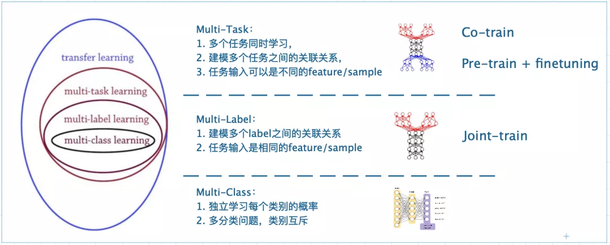
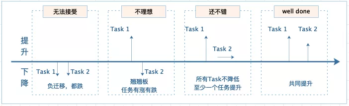

## 背景与动机

在推荐系统的精排模块，多任务学习的模型结构已成业界的主流，获得了广阔的应用。多任务学习（multi-task learning），本质上是希望使用一个模型完成多个任务的建模。在推荐系统中，多任务学习一般即指多目标学习（multi-label learning），不同目标输入相同的feature进行联合训练，是迁移学习的一种。他们之间的关系如图：

<div align=center>  

</div>

下面我们先讨论三个问题

**一、为什么要用多任务学习？**

（1）很多业界推荐的业务，天然就是一个多目标的建模场景，需要多目标共同优化。以微信视频号推荐为例，打开一个视频，如图，首页上除了由于视频自动播放带来的“播放时长”、“完播率”（用户播放时长占视频长度的比例）目标之外，还有大量的互动标签，例如“点击好友头像”、“进入主页”、“关注”、“收藏”、“分享”、“点赞”、“评论”等。究竟哪一个标签最符合推荐系统的建模目标呢？

<div align=center>

</div>


如果要用一个词来概括所有各式各样的推荐系统的终极目标，那就是“用户满意度”，但我们无法找到一个显示的指标量化用户满意度。业界一般使用“DAU”、“用户日均使用时长”、“留存率”来作为客观的间接的“用户满意度”（或者说算法工程师绩效）评价指标。而这些指标都是难以通过单一目标建模的，以使用时长为例，长视频播放长度天然大于短视频。所幸的是，虽然没有显式的用户满意度评价指标，但是现在的app都存在类似上述视频号推荐场景的丰富具体的隐式反馈。但这些独立的隐式反馈也存在一些挑战：

- 目标偏差：点赞、分享表达的满意度可能比播放要高
- 物品偏差：不同视频的播放时长体现的满意度不一样，有的视频可能哄骗用户看到尾部（类似新闻推荐中的标题党）
- 用户偏差：有的用户表达满意喜欢用点赞，有的用户可能喜欢用收藏

因此我们需要使用多任务学习模型针对多个目标进行预测，并在线上融合多目标的预测结果进行排序。多任务学习也不能直接表达用户满意度，但是可以最大限度利用能得到的用户反馈信息进行充分的表征学习，并且可建模业务之间的关系，从而高效协同学习具体任务。

（2）工程便利，不用针对不同的任务训练不同的模型。一般推荐系统中排序模块延时需求在40ms左右，如果分别对每个任务单独训练一个模型，难以满足需求。出于控制成本的目的，需要将部分模型进行合并。合并之后，能更高效的利用训练资源和进行模型的迭代升级。

**二、为什么多任务学习有效？**

当把业务独立建模变成多任务联合建模之后，有可能带来四种结果：

<div align=center>

</div>

多任务学习的优势在于通过部分参数共享，联合训练，能在保证“还不错”的前提下，实现多目标共同提升。原因有以下几种：

- 任务互助：对于某个任务难学到的特征，可通过其他任务学习
- 隐式数据增强：不同任务有不同的噪声，一起学习可抵消部分噪声
- 学到通用表达，提高泛化能力：模型学到的是对所有任务都偏好的权重，有助于推广到未来的新任务
- 正则化：对于一个任务而言，其他任务的学习对该任务有正则化效果

**三、多任务学习都在研究什么问题**？

如上所述，多任务的核心优势在于通过不同任务的网络参数共享，实现1+1>2的提升，因此多任务学习的一大主流研究方向便是如何设计有效的网络结构。多个label的引入自然带来了多个loss，那么如何在联合训练中共同优化多个loss则是关键问题。

- 网络结构设计：主要研究哪些参数共享、在什么位置共享、如何共享。这一方向我们认为可以分为两大类，第一类是在设计网络结构时，考虑目标间的显式关系（例如淘宝中，点击之后才有购买行为发生），以阿里提出的ESMM为代表；另一类是目标间没有显示关系（例如短视频中的收藏与分享），在设计模型时不考虑label之间的量化关系，以谷歌提出的MMOE为代表。
- 多loss的优化策略：主要解决loss数值有大有小、学习速度有快有慢、更新方向时而相反的问题。最经典的两个工作有UWL（Uncertainty Weight）：通过自动学习任务的uncertainty，给uncertainty大的任务小权重，uncertainty小的任务大权重；GradNorm：结合任务梯度的二范数和loss下降梯度，引入带权重的损失函数Gradient Loss，并通过梯度下降更新该权重。

## loss加权融合

一种最简单的实现多任务学习的方式是对不同任务的loss进行加权。例如谷歌的Youtube DNN论文中提到的一种加权交叉熵：
$$
\text { Weighted CE Loss }=-\sum_{i}\left[T_{i} y_{i} \log p_{i}+\left(1-y_{i}\right) \log \left(1-p_{i}\right)\right]
$$
其中![[公式]](https://www.zhihu.com/equation?tex=T_i) 为观看时长。在原始训练数据中，正样本是视频展示后用户点击了该视频，负样本则是展示后未点击，这个一个标准的CTR预估问题。该loss通过改变训练样本的权重，让所有负样本的权重都为 1，而正样本的权重为点击后的视频观看时长 ![[公式]](https://www.zhihu.com/equation?tex=T_i) 。作者认为按点击率排序会倾向于把诱惑用户点击（用户未必真感兴趣)的视频排前面，而观看时长能更好地反映出用户对视频的兴趣，通过重新设计loss使得该模型在保证主目标点击的同时，将视频观看时长转化为样本的权重，达到优化平均观看时长的效果。

另一种更为简单粗暴的加权方式是人工手动调整权重，例如 0.3\*L(点击)+0.7*L\*(视频完播)

这种loss加权的方式优点如下：

- 模型简单，仅在训练时通过梯度乘以样本权重实现对其它目标的加权
- 模型上线简单，和base完全相同，不需要额外开销

缺点：

- 本质上并不是多目标建模，而是将不同的目标转化为同一个目标。样本的加权权重需要根据AB测试才能确定。

## Shared-Bottom

最早的多任务学习模型是底层共享结构（Shared-Bottom），如图所示。

通过共享底层模块，学习任务间通用的特征表征，再往上针对每一个任务设置一个Tower网络，每个Tower网络的参数由自身对应的任务目标进行学习。Shared Bottom可以根据自身数据特点，使用MLP、DeepFM、DCN、DIN等，Tower网络一般使用简单的MLP。

代码如下，共享特征embedding，共享底层DNN网络，任务输出层独立，loss直接使用多个任务的loss值之和。

```python
def Shared_Bottom(dnn_feature_columns, num_tasks=None, task_types=None, task_names=None,
                  bottom_dnn_units=[128, 128], tower_dnn_units_lists=[[64,32], [64,32]],
                  l2_reg_embedding=0.00001, l2_reg_dnn=0, seed=1024,dnn_dropout=0,
                  dnn_activation='relu', dnn_use_bn=False):

    features = build_input_features(dnn_feature_columns)
    inputs_list = list(features.values())
    
    sparse_embedding_list, dense_value_list = input_from_feature_columns(features, dnn_feature_columns, l2_reg_embedding,seed)
    #共享输入特征
    dnn_input = combined_dnn_input(sparse_embedding_list, dense_value_list)
    #共享底层网络
    shared_bottom_output = DNN(bottom_dnn_units, dnn_activation, l2_reg_dnn, dnn_dropout, dnn_use_bn, seed=seed)(dnn_input)
    #任务输出层
    tasks_output = []
    for task_type, task_name, tower_dnn in zip(task_types, task_names, tower_dnn_units_lists):
        tower_output = DNN(tower_dnn, dnn_activation, l2_reg_dnn, dnn_dropout, dnn_use_bn, seed=seed, name='tower_'+task_name)(shared_bottom_output)

        logit = tf.keras.layers.Dense(1, use_bias=False, activation=None)(tower_output)
        output = PredictionLayer(task_type, name=task_name)(logit) 
        tasks_output.append(output)

    model = tf.keras.models.Model(inputs=inputs_list, outputs=tasks_output)
    return model
```

优点：

- 浅层参数共享，互相补充学习，任务相关性越高，模型loss优化效果越明显，也可以加速训练。

缺点：

- 任务不相关甚至优化目标相反时（例如新闻的点击与阅读时长），可能会带来负收益，多个任务性能一起下降。

一般把Shared-Bottom的结构称作“参数硬共享”，多任务学习网络结构设计的发展方向便是如何设计更灵活的共享机制，从而实现“参数软共享”。


参考资料：

[https://developer.aliyun.com/article/793252](https://link.zhihu.com/?target=https%3A//developer.aliyun.com/article/793252)

https://zhuanlan.zhihu.com/p/291406172

Gradnorm: Gradient normalization for adaptive loss balancing in deep multitask networks (ICML'2018)

UWL: Multi-task learning using uncertainty to weigh losses for scene geometry and semantics (CVPR'2018)

YoutubeDNN: Deep neural networks for youtube recommendations (RecSys'2016)