# PLE

**PLE**(Progressive Layered Extraction)模型由腾讯PCG团队在2020年提出，主要为了解决跷跷板问题，该论文获得了RecSys'2020的最佳长论文（Best Lone Paper Award）。

## 背景与动机

文章首先提出多任务学习中不可避免的两个缺点：

- 负迁移（Negative Transfer）：针对相关性较差的任务，使用shared-bottom这种硬参数共享的机制会出现负迁移现象，不同任务之间存在冲突时，会导致模型无法有效进行参数的学习，不如对多个任务单独训练。
- 跷跷板现象（Seesaw Phenomenon）：针对相关性较为复杂的场景，通常不可避免出现跷跷板现象。多任务学习模式下，往往能够提升一部分任务的效果，但同时需要牺牲其他任务的效果。即使通过MMOE这种方式减轻负迁移现象，跷跷板问题仍然广泛存在。

在腾讯视频推荐场景下，有两个核心建模任务：

- VCR(View Completion Ratio)：播放完成率，播放时间占视频时长的比例，回归任务
- VTR(View Through Rate) ：有效播放率，播放时间是否超过某个阈值，分类任务

这两个任务之间的关系是复杂的，在应用以往的多任务模型中发现，要想提升VTR准确率，则VCR准确率会下降，反之亦然。

上一小节提到的MMOE网络存在如下几个缺点

- MMOE中所有的Expert是被所有任务所共享，这可能无法捕捉到任务之间更复杂的关系，从而给部分任务带来一定的噪声。
- 在复杂任务机制下，MMOE不同专家在不同任务的权重学的差不多
- 不同的Expert之间没有交互，联合优化的效果有所折扣

## 解决方案

为了解决跷跷板现象，以及优化MMOE模型，PLE在网络结构设计上提出两大改进：

**一、CGC**(Customized Gate Control) 定制门控

PLE将共享的部分和每个任务特定的部分**显式的分开**，强化任务自身独立特性。把MMOE中提出的Expert分成两种，任务特定task-specific和任务共享task-shared。保证expert“各有所得”，更好的降低了弱相关性任务之间参数共享带来的问题。

网络结构如图所示，同样的特征输入分别送往三类不同的专家模型（任务A专家、任务B专家、任务共享专家），再通过门控机制加权聚合之后输入各自的Tower网络。门控网络，把原始数据和expert网络输出共同作为输入，通过单层全连接网络+softmax激活函数，得到分配给expert的加权权重，与attention机制类型。


<div align=center>
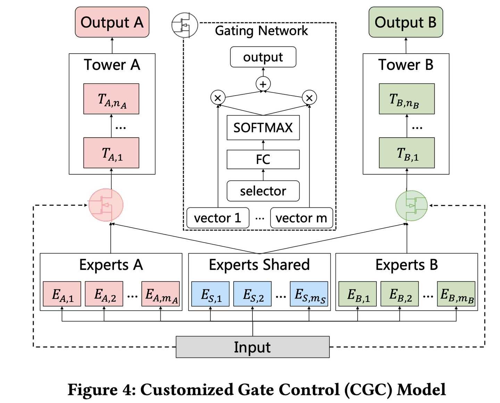
</div>

任务A有 ![[公式]](https://www.zhihu.com/equation?tex=m_A) 个expert，任务B有 ![[公式]](https://www.zhihu.com/equation?tex=m_B) 个expert，另外还有 ![[公式]](https://www.zhihu.com/equation?tex=m_S) 个任务A、B共享的Expert。这样对Expert做一个显式的分割，可以让task-specific expert只受自己任务梯度的影响，不会受到其他任务的干扰（每个任务保底有一个独立的网络模型)，而只有task-shared expert才受多个任务的混合梯度影响。

MMOE则是将所有Expert一视同仁，都加权输入到每一个任务的Tower，其中任务之间的关系完全交由gate自身进行学习。虽然MMOE提出的门控机制理论上可以捕捉到任务之间的关系，比如任务A可能与任务B确实无关，则MMOE中gate可以学到，让个别专家对于任务A的权重趋近于0，近似得到PLE中提出的task-specific expert。如果说MMOE是希望让expert网络可以对不同的任务各有所得，则PLE是保证让expert网络各有所得。

二、**PLE** (progressive layered extraction) 分层萃取

PLE就是上述CGC网络的多层纵向叠加，以获得更加丰富的表征能力。在分层的机制下，Gate设计成两种类型，使得不同类型Expert信息融合交互。task-share gate融合所有Expert信息，task-specific gate只融合specific expert和share expert。模型结构如图：

<div align=center>

</div>

将任务A、任务B和shared expert的输出输入到下一层，下一层的gate是以这三个上一层输出的结果作为门控的输入，而不是用原始input特征作为输入。这使得gate同时融合task-shares expert和task-specific expert的信息，论文实验中证明这种不同类型expert信息的交叉，可以带来更好的效果。

三、多任务loss联合优化

该论文专门讨论了loss设计的问题。在传统的多任务学习模型中，多任务的loss一般为

<div align=center>

</div>

其中K是指任务数， ![[公式]](https://www.zhihu.com/equation?tex=w_k) 是每个任务各自对应的权重。这种loss存在两个关键问题：

- 不同任务之间的样本空间不一致：在视频推荐场景中，目标之间的依赖关系如图，曝光→播放→点击→(分享、评论），不同任务有不同的样本空间。

  <div align=center>
  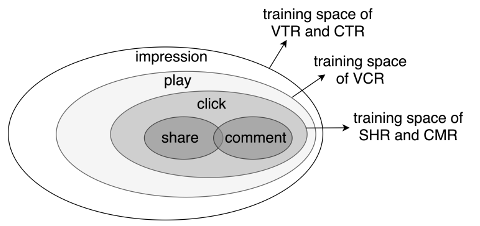
  </div>


​		PLE将训练样本空间作为全部任务样本空间的并集，在分别针对每个任务算loss时，只考虑该任务的样本的空		间，一般需对这种数据集会附带一个样本空间标签。loss公式如下：

<div align=center>
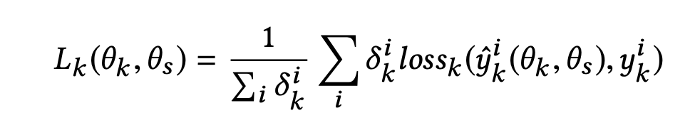
</div>


​		其中， ![[公式]](https://www.zhihu.com/equation?tex=%5Cdelta_%7Bk%7D%5E%7Bi%7D+%5Cin%5C%7B0%2C1%5C%7D%2C+%5Cdelta_%7Bk%7D%5E%7Bi%7D+) 表示样本i是否处于任务k的样本空间。

- 不同任务各自独立的权重设定：PLE提出了一种加权的规则，它的思想是随着迭代次数的增加，任务的权重应当不断衰减。它为每个任务设定一个初始权重 ![[公式]](https://www.zhihu.com/equation?tex=w_%7Bk%2C0%7D) ，再按该公式进行更新：

  <div align=center>
  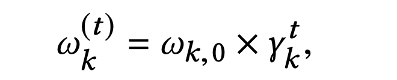
  </div>

## 实验

该论文的一大特点是提供了极其丰富的实验，首先是在自身大规模数据集上的离线实验。

第一组实验是两个关系复杂的任务VTR（回归）与VCR（分类），如表1，实验结果证明PLE可以实现多任务共赢，而其他的硬共享或者软共享机制，则会导致部分任务受损。

<div align=center>
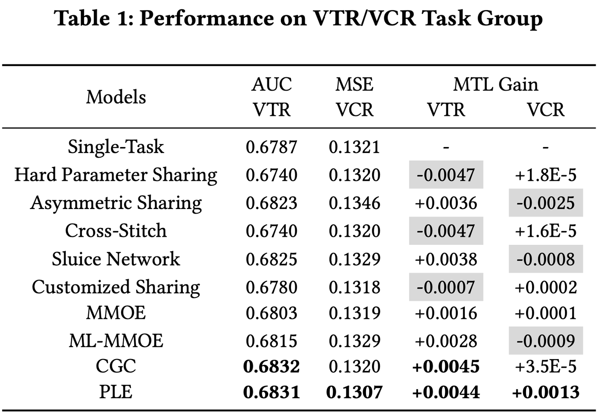
</div>


第二组实验是两个关系简单清晰的任务，CTR与VCR，都是分类任务，且CTR→VCR存在任务依赖关系，如表2，这种多任务下，基本上所有参数共享的模型都能得到性能的提升，而PLE的提升效果最为明显。

<div align=center>
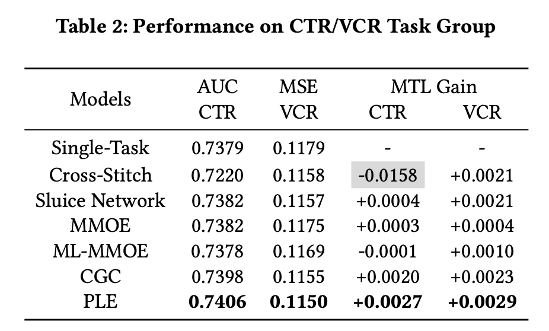
</div>


第三组实验则是线上的A/B Test，上面两组离线实验中，其实PLE相比于其他baseline模型，无论是回归任务的mse，还是分类任务的auc，提升都不是特别显著。在推荐场景中，评估模型性能的最佳利器还是线上的A/B Test。作者在pcg视频推荐的场景中，将部分用户随机划分到不同的实验组中，用PLE模型预估VTR和VCR，进行四周的实验。如表3所示，线上评估指标（总播放完成视频数量和总播放时间）均得到了较为显著的提升，而硬参数共享模型则带对两个指标都带来显著的下降。

<div align=center>
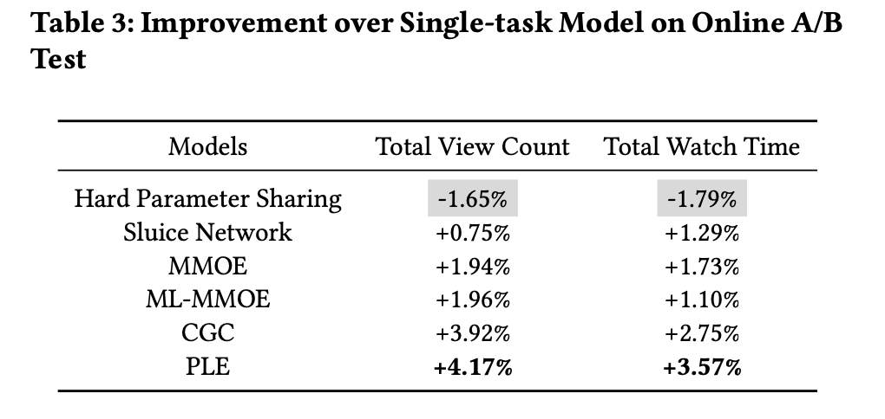
</div>

第四组实验中，作者引入了更多的任务，验证PLE分层结构的必要性。如表4，随着任务数量的增加，PLE对比CGC的优势更加显著。

<div align=center>
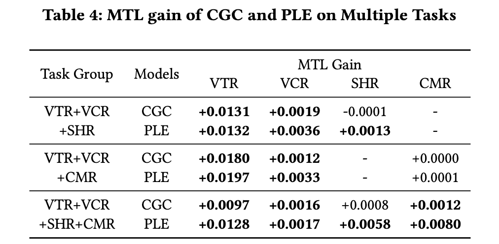
</div>

文中也设计实验，单独对MMOE和CGC的专家利用率进行对比分析，为了实现方便和公平，每个expert都是一个一层网络，每个expert module都只有一个expert，每一层只有3个expert。如图所示，柱子的高度和竖直短线分别表示expert权重的均值和方差。

<div align=center>
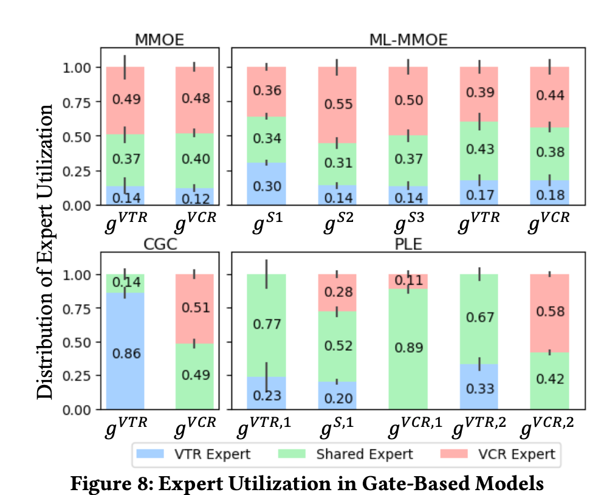
</div>


可以看到，无论是 MMoE 还是 ML-MMoE，不同任务在三个 Expert 上的权重都是接近的，但对于 CGC & PLE 来说，不同任务在共享 Expert 上的权重是有较大差异的。PLE针对不同的任务，能够有效利用共享 Expert 和独有 Expert 的信息，解释了为什么其能够达到比 MMoE 更好的训练结果。CGC理论上是MMOE的子集，该实验表明，现实中MMOE很难收敛成这个CGC的样子，所以PLE模型就显式的规定了CGC这样的结构。

## 总结与拓展

总结：

CGC在结构上设计的分化，实现了专家功能的分化，而PLE则是通过分层叠加，使得不同专家的信息进行融合。整个结构的设计，是为了让多任务学习模型，不仅可以学习到各自任务独有的表征，还能学习不同任务共享的表征。

论文中也对大多数的MTL模型进行了抽象，总结如下图：

<div align=center>
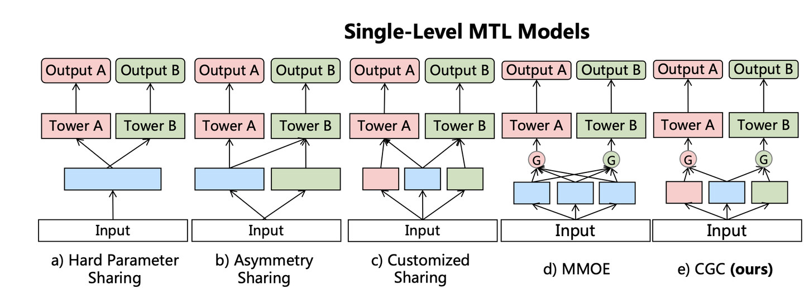
</div>


不同的MTL模型即不同的参数共享机制，CGC的结构最为灵活。

可以思考下以下几个问题：

1. 多任务模型线上如何打分融合？
   在论文中，作者分享了腾讯视频的一种线上打分机制
   
   <div align=center>
   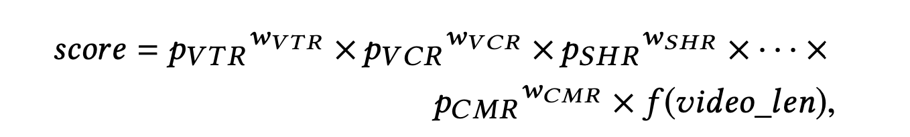
   </div>
   
   ​	每个目标的预估值有一个固定的权重，通过乘法进行融合，并在最后未来排除视频自身时长的影响，使用	$		f(videolen)$对视频时长进行了非线性变化。其实在业界的案例中，也基本是依赖乘法或者加法进行融合，爱奇艺曾经公开分享过他们使用过的打分方法：
   
   <div align=center>
   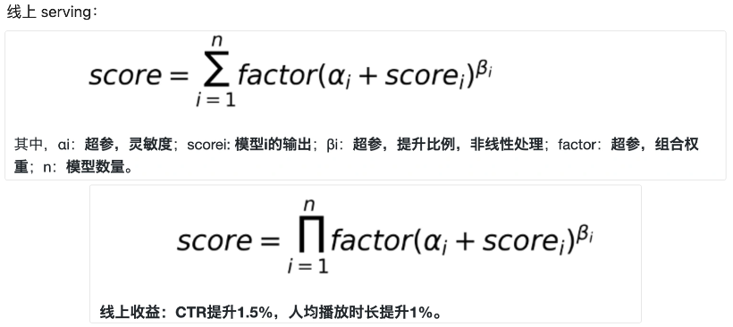
   </div>


​			在业务目标较少时，通过加法方式融合新增目标可以短期内快速获得收益。但是随着目标增多，加法融合会			逐步弱化各字母表的重要性影响，而乘法融合则具有一定的模板独立性，乘法机制更加灵活，效益更好。融			合的权重超参一般在线上通过A/B test调试。

2. 专家的参数如何设置？
   PLE模型存在的超参数较多，其中专家和门控网络都有两种类型。一般来说，task-specific expert每个任务1-2个，shared expert个数在任务个数的1倍以上。原论文中的gate网络即单层FC，可以适当增加，调试。

3. ESMM、MMOE、PLE模型如何选择？

   - 个人经验，无论任务之间是否有依赖关系，皆可以优先尝试CGC。而多层CGC（即PLE）未必比CGC效果好，且在相同参数规模小，CGC普遍好于MMOE。对于相关性特别差的多任务，CGC相对MMOE而言有多个专有expert兜底。

   - 对于典型的label存在路径依赖的多任务，例如CTR与CVR，可尝试ESMM。

   - 而在业界的实践案例中，更多的是两种范式的模型进行融合。例如美团在其搜索多业务排序场景上提出的模型：

     <div align=center>
     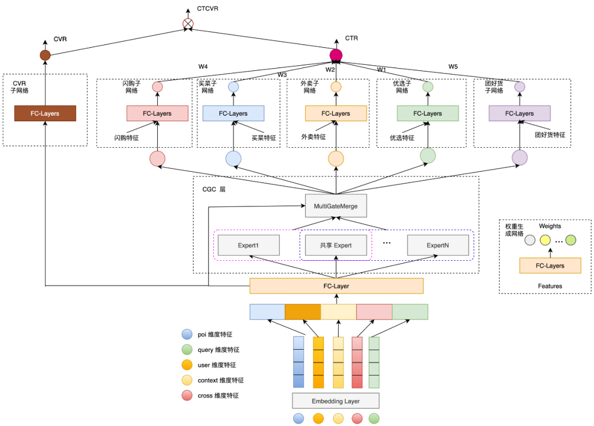
     </div>

     

     总框架是ESMM的架构，以建模下单（CVR）为主任务，CTR和CTCVR为辅助任务。在底层的模块中，则使用了CGC模块，提取多任务模式下的特征表达信息。

4. 不同Tower能否输入不同的特征？不同的expert使用不同的特征？不同的门控使用不同的特征？
   MMOE、PLE原论文中介绍的模型均是使用同样的原始特征输入各个不同的expert，也输入给第一层的gate。最顶层的Tower网络中则均是由一个gate融合所有expert输出作为输入。在实践中，可以根据业务需求进行调整。

   - 例如上图中美团提出的模型，在CTR的tower下，设置了五个子塔：闪购子网络、买菜子网络、外卖子网络、优选子网络和团好货子网络，并且对不同的子塔有额外输入不同的特征。
     对于底层输入给expert的特征，美团提出通过增加一个自适应的特征选择门，使得选出的特征对不同的业务权重不同。例如“配送时间”这个特征对闪购业务比较重要，但对于团好货影响不是很大。模型结构如图：

     <div align=center>
     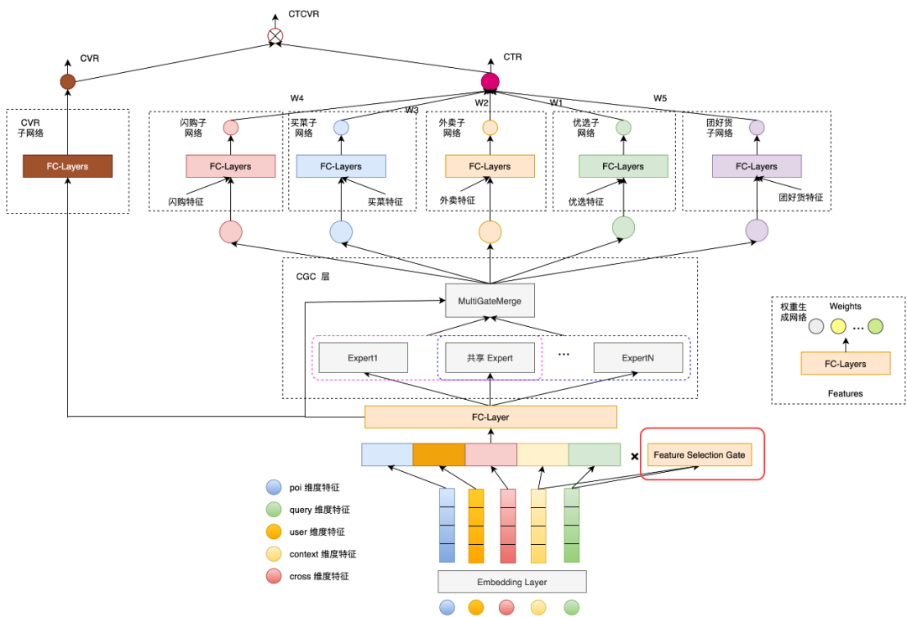
     </div>

     

     特征选择门与控制expert信息融合的gate类似，由一层FC和softmax组成，输出是特征维度的权重。对于每一个特征通过该门都得到一个权重向量，权重向量点乘原始特征的embedding作为expert的输入。

5. 多任务loss更高效的融合机制

   推荐首先尝试两种简单实用的方法，GrandNorm和UWL，具体实现细节查看下文所附的参考资料。

   - UWL（Uncertainty Weight）：通过自动学习任务的uncertainty，给uncertainty大的任务小权重，uncertainty小的任务大权重；
   - GradNorm：结合任务梯度的二范数和loss下降梯度，引入带权重的损失函数Gradient Loss，并通过梯度下降更新该权重。

## 代码实践

主要是分两个层级，在PLE的层级下，由于PLE是分层，上一层是输出是下一层的输入，代码逻辑为：

```python
# build Progressive Layered Extraction
  ple_inputs = [dnn_input] * (num_tasks + 1)  # [task1, task2, ... taskn, shared task]
  ple_outputs = []
  for i in range(num_levels):
      if i == num_levels - 1:  # the last level
          ple_outputs = cgc_net(inputs=ple_inputs, level_name='level_' + str(i) + '_', is_last=True)
      else:
          ple_outputs = cgc_net(inputs=ple_inputs, level_name='level_' + str(i) + '_', is_last=False)
          ple_inputs = ple_outputs
```

其中cgc_net函数则对应论文中提出的CGC模块，我们把expert分成两类，task-specific和task-shared，为了方便索引，expert list中expert的排列顺序为[task1-expert1, task1-expert2,...task2-expert1, task2-expert2,...shared expert 1... ]，则可以通过双重循环创建专家网络:

```python
for i in range(num_tasks): #任务个数
      for j in range(specific_expert_num): #每个任务对应的task-specific专家个数
        pass
```

注意门控网络也分为两种类型，task-specific gate的输入是每个任务对应的expert的输出和共享expert的输出，我们同样把共享expert的输出放在最后，方便索引

```python
for i in range(num_tasks):
    # concat task-specific expert and task-shared expert
    cur_expert_num = specific_expert_num + shared_expert_num
    # task_specific + task_shared
    cur_experts = specific_expert_outputs[
                  i * specific_expert_num:(i + 1) * specific_expert_num] + shared_expert_outputs
```

在最后一层中，由于CGC模块的输出需要分别输入给不同任务各自的Tower模块，所以不需要创建task-shared gate。完整代码如下

```python
def PLE(dnn_feature_columns, shared_expert_num=1, specific_expert_num=1, num_levels=2,
        expert_dnn_hidden_units=(256,), tower_dnn_hidden_units=(64,), gate_dnn_hidden_units=(),
        l2_reg_embedding=0.00001,
        l2_reg_dnn=0, seed=1024, dnn_dropout=0, dnn_activation='relu', dnn_use_bn=False,
        task_types=('binary', 'binary'), task_names=('ctr', 'ctcvr')):
    """Instantiates the multi level of Customized Gate Control of Progressive Layered Extraction architecture.
    :param dnn_feature_columns: An iterable containing all the features used by deep part of the model.
    :param shared_expert_num: integer, number of task-shared experts.
    :param specific_expert_num: integer, number of task-specific experts.
    :param num_levels: integer, number of CGC levels.
    :param expert_dnn_hidden_units: list,list of positive integer or empty list, the layer number and units in each layer of expert DNN.
    :param tower_dnn_hidden_units: list,list of positive integer or empty list, the layer number and units in each layer of task-specific DNN.
    :param gate_dnn_hidden_units: list,list of positive integer or empty list, the layer number and units in each layer of gate DNN.
    :param l2_reg_embedding: float. L2 regularizer strength applied to embedding vector.
    :param l2_reg_dnn: float. L2 regularizer strength applied to DNN.
    :param seed: integer ,to use as random seed.
    :param dnn_dropout: float in [0,1), the probability we will drop out a given DNN coordinate.
    :param dnn_activation: Activation function to use in DNN.
    :param dnn_use_bn: bool. Whether use BatchNormalization before activation or not in DNN.
    :param task_types: list of str, indicating the loss of each tasks, ``"binary"`` for  binary logloss, ``"regression"`` for regression loss. e.g. ['binary', 'regression']
    :param task_names: list of str, indicating the predict target of each tasks
    :return: a Keras model instance.
    """
    num_tasks = len(task_names)
    if num_tasks <= 1:
        raise ValueError("num_tasks must be greater than 1")

    if len(task_types) != num_tasks:
        raise ValueError("num_tasks must be equal to the length of task_types")

    for task_type in task_types:
        if task_type not in ['binary', 'regression']:
            raise ValueError("task must be binary or regression, {} is illegal".format(task_type))

    features = build_input_features(dnn_feature_columns)

    inputs_list = list(features.values())

    sparse_embedding_list, dense_value_list = input_from_feature_columns(features, dnn_feature_columns,
                                                                         l2_reg_embedding, seed)
    dnn_input = combined_dnn_input(sparse_embedding_list, dense_value_list)

    # single Extraction Layer
    def cgc_net(inputs, level_name, is_last=False):
        # inputs: [task1, task2, ... taskn, shared task]
        specific_expert_outputs = []
        # build task-specific expert layer
        for i in range(num_tasks):
            for j in range(specific_expert_num):
                expert_network = DNN(expert_dnn_hidden_units, dnn_activation, l2_reg_dnn, dnn_dropout, dnn_use_bn,
                                     seed=seed,
                                     name=level_name + 'task_' + task_names[i] + '_expert_specific_' + str(j))(
                    inputs[i])
                specific_expert_outputs.append(expert_network)

        # build task-shared expert layer
        shared_expert_outputs = []
        for k in range(shared_expert_num):
            expert_network = DNN(expert_dnn_hidden_units, dnn_activation, l2_reg_dnn, dnn_dropout, dnn_use_bn,
                                 seed=seed,
                                 name=level_name + 'expert_shared_' + str(k))(inputs[-1])
            shared_expert_outputs.append(expert_network)

        # task_specific gate (count = num_tasks)
        cgc_outs = []
        for i in range(num_tasks):
            # concat task-specific expert and task-shared expert
            cur_expert_num = specific_expert_num + shared_expert_num
            # task_specific + task_shared
            cur_experts = specific_expert_outputs[
                          i * specific_expert_num:(i + 1) * specific_expert_num] + shared_expert_outputs

            expert_concat = tf.keras.layers.Lambda(lambda x: tf.stack(x, axis=1))(cur_experts)

            # build gate layers
            gate_input = DNN(gate_dnn_hidden_units, dnn_activation, l2_reg_dnn, dnn_dropout, dnn_use_bn,
                             seed=seed,
                             name=level_name + 'gate_specific_' + task_names[i])(
                inputs[i])  # gate[i] for task input[i]
            gate_out = tf.keras.layers.Dense(cur_expert_num, use_bias=False, activation='softmax',
                                             name=level_name + 'gate_softmax_specific_' + task_names[i])(gate_input)
            gate_out = tf.keras.layers.Lambda(lambda x: tf.expand_dims(x, axis=-1))(gate_out)

            # gate multiply the expert
            gate_mul_expert = tf.keras.layers.Lambda(lambda x: reduce_sum(x[0] * x[1], axis=1, keep_dims=False),
                                                     name=level_name + 'gate_mul_expert_specific_' + task_names[i])(
                [expert_concat, gate_out])
            cgc_outs.append(gate_mul_expert)

        # task_shared gate, if the level not in last, add one shared gate
        if not is_last:
            cur_expert_num = num_tasks * specific_expert_num + shared_expert_num
            cur_experts = specific_expert_outputs + shared_expert_outputs  # all the expert include task-specific expert and task-shared expert

            expert_concat = tf.keras.layers.Lambda(lambda x: tf.stack(x, axis=1))(cur_experts)

            # build gate layers
            gate_input = DNN(gate_dnn_hidden_units, dnn_activation, l2_reg_dnn, dnn_dropout, dnn_use_bn,
                             seed=seed,
                             name=level_name + 'gate_shared')(inputs[-1])  # gate for shared task input

            gate_out = tf.keras.layers.Dense(cur_expert_num, use_bias=False, activation='softmax',
                                             name=level_name + 'gate_softmax_shared')(gate_input)
            gate_out = tf.keras.layers.Lambda(lambda x: tf.expand_dims(x, axis=-1))(gate_out)

            # gate multiply the expert
            gate_mul_expert = tf.keras.layers.Lambda(lambda x: reduce_sum(x[0] * x[1], axis=1, keep_dims=False),
                                                     name=level_name + 'gate_mul_expert_shared')(
                [expert_concat, gate_out])

            cgc_outs.append(gate_mul_expert)
        return cgc_outs

    # build Progressive Layered Extraction
    ple_inputs = [dnn_input] * (num_tasks + 1)  # [task1, task2, ... taskn, shared task]
    ple_outputs = []
    for i in range(num_levels):
        if i == num_levels - 1:  # the last level
            ple_outputs = cgc_net(inputs=ple_inputs, level_name='level_' + str(i) + '_', is_last=True)
        else:
            ple_outputs = cgc_net(inputs=ple_inputs, level_name='level_' + str(i) + '_', is_last=False)
            ple_inputs = ple_outputs

    task_outs = []
    for task_type, task_name, ple_out in zip(task_types, task_names, ple_outputs):
        # build tower layer
        tower_output = DNN(tower_dnn_hidden_units, dnn_activation, l2_reg_dnn, dnn_dropout, dnn_use_bn, seed=seed,
                           name='tower_' + task_name)(ple_out)
        logit = tf.keras.layers.Dense(1, use_bias=False, activation=None)(tower_output)
        output = PredictionLayer(task_type, name=task_name)(logit)
        task_outs.append(output)

    model = tf.keras.models.Model(inputs=inputs_list, outputs=task_outs)
    return model
```

参考资料

Progressive Layered Extraction (PLE): A Novel Multi-Task Learning (MTL) Model for Personalized Recommendations (RecSys'2020)

https://zhuanlan.zhihu.com/p/291406172

爱奇艺：[https://www.6aiq.com/article/1624916831286](https://link.zhihu.com/?target=https%3A//www.6aiq.com/article/1624916831286)

美团：[https://mp.weixin.qq.com/s/WBwvfqOTDKCwGgoaGoSs6Q](https://link.zhihu.com/?target=https%3A//mp.weixin.qq.com/s/WBwvfqOTDKCwGgoaGoSs6Q)

多任务loss优化：[https://blog.csdn.net/wuzhongqi](https://link.zhihu.com/?target=https%3A//blog.csdn.net/wuzhongqiang/article/details/124258128)

