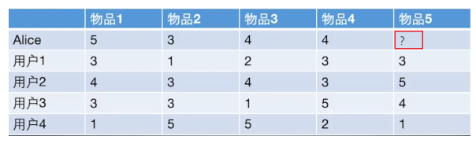
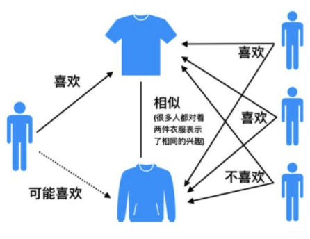
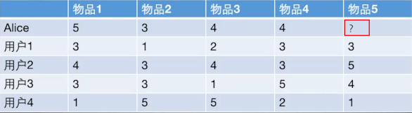
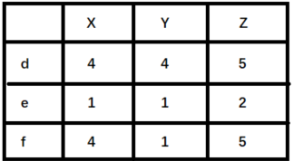

# 协同过滤算法

## 基本思想

协同过滤（Collaborative Filtering）推荐算法是最经典、最常用的推荐算法。基本思想是：

+ 根据用户之前的喜好以及其他兴趣相近的用户的选择来给用户推荐物品。

  + 基于对用户历史行为数据的挖掘发现用户的喜好偏向， 并预测用户可能喜好的产品进行推荐。
  + 一般是仅仅基于用户的行为数据（评价、购买、下载等）, 而不依赖于项的任何附加信息（物品自身特征）或者用户的任何附加信息（年龄， 性别等）。
+ 目前应用比较广泛的协同过滤算法是基于邻域的方法，主要有：
  + 基于用户的协同过滤算法（UserCF）：给用户推荐和他兴趣相似的其他用户喜欢的产品。
  + 基于物品的协同过滤算法（ItemCF）：给用户推荐和他之前喜欢的物品相似的物品。

不管是 UserCF 还是 ItemCF 算法， 重点是计算用户之间（或物品之间）的相似度。

## 相似性度量方法

1. **杰卡德（Jaccard）相似系数**

   `Jaccard` 系数是衡量两个集合的相似度一种指标，计算公式如下：
   $$
   sim_{uv}=\frac{|N(u) \cap N(v)|}{|N(u)| \cup|N(v)|}
   $$

   + 其中 $N(u)$，$N(v)$ 分别表示用户 $u$ 和用户 $v$ 交互物品的集合。

   + 对于用户 $u$ 和 $v$ ，该公式反映了两个交互物品交集的数量占这两个用户交互物品并集的数量的比例。

   由于杰卡德相似系数一般无法反映具体用户的评分喜好信息，所以常用来评估用户是否会对某物品进行打分， 而不是预估用户会对某物品打多少分。

2. **余弦相似度**
   余弦相似度衡量了两个向量的夹角，夹角越小越相似。余弦相似度的计算如下，其与杰卡德（Jaccard）相似系数只是在分母上存在差异：
   $$
   sim_{uv}=\frac{|N(u) \cap N(v)|}{\sqrt{|N(u)|\cdot|N(v)|}}
   $$
   从向量的角度进行描述，令矩阵 $A$ 为用户-物品交互矩阵，矩阵的行表示用户，列表示物品。

   + 设用户和物品数量分别为 $m,n$，交互矩阵$A$就是一个 $m$ 行 $n$ 列的矩阵。

   + 矩阵中的元素均为 $0/1$。若用户 $i$ 对物品 $j$ 存在交互，那么 $A_{i,j}=1$，否则为 $0$ 。

   + 那么，用户之间的相似度可以表示为：
     $$
     sim_{uv} = cos(u,v) =\frac{u\cdot v}{|u|\cdot |v|}
     $$

     + 向量 $u,v$ 在形式都是 one-hot 类型，$u\cdot v$ 表示向量点积。

   上述用户-物品交互矩阵在现实中是十分稀疏的，为了节省内存，交互矩阵会采用字典进行存储。在 `sklearn` 中，余弦相似度的实现：

   ```python
   from sklearn.metrics.pairwise import cosine_similarity
   
   i = [1, 0, 0, 0]
   j = [1, 0, 1, 0]
   cosine_similarity([i, j])
   ```

3. **皮尔逊相关系数**

   在用户之间的余弦相似度计算时，将用户向量的内积展开为各元素乘积和：
   $$
   sim_{uv} = \frac{\sum_i r_{ui}*r_{vi}}{\sqrt{\sum_i r_{ui}^2}\sqrt{\sum_i r_{vi}^2}}
   $$

   + 其中，$r_{ui},r_{vi}$ 分别表示用户 $u$ 和用户 $v$ 对物品 $i$ 是否有交互(或具体评分值)。

   皮尔逊相关系数与余弦相似度的计算公式非常的类似，如下：
   $$
   sim(u,v)=\frac{\sum_{i\in I}(r_{ui}-\bar r_u)(r_{vi}-\bar r_v)}{\sqrt{\sum_{i\in I }(r_{ui}-\bar r_u)^2}\sqrt{\sum_{i\in I }(r_{vi}-\bar r_v)^2}}
   $$

   + 其中，$r_{ui},r_{vi}$ 分别表示用户 $u$ 和用户 $v$ 对物品 $i$ 是否有交互(或具体评分值)；
   + $\bar r_u, \bar r_v$ 分别表示用户 $u$ 和用户 $v$ 交互的所有物品交互数量或者评分的平均值；

   相较于余弦相似度，皮尔逊相关系数通过使用用户的平均分对各独立评分进行修正，减小了用户评分偏置的影响。在`scipy`中，皮尔逊相关系数的实现：

   ```python
   from scipy.stats import pearsonr
   
   i = [1, 0, 0, 0]
   j = [1, 0.5, 0.5, 0]
   pearsonr(i, j)
   ```

**适用场景**

+ $Jaccard$ 相似度表示两个集合的交集元素个数在并集中所占的比例 ，所以适用于隐式反馈数据（0-1）。
+ 余弦相似度在度量文本相似度、用户相似度、物品相似度的时候都较为常用。
+ 皮尔逊相关度，实际上也是一种余弦相似度。不过先对向量做了中心化，范围在 $-1$ 到 $1$。
  + 相关度量的是两个变量的变化趋势是否一致，两个随机变量是不是同增同减。
  + 不适合用作计算布尔值向量（0-1）之间相关度。

# 基于用户的协同过滤

## 基本思想

基于用户的协同过滤（UserCF）：

+ 例如，我们要对用户 $A$ 进行物品推荐，可以先找到和他有相似兴趣的其他用户。
+ 然后，将共同兴趣用户喜欢的，但用户 $A$ 未交互过的物品推荐给 $A$。  


## 计算过程

以下图为例，给用户推荐物品的过程可以形象化为一个猜测用户对物品进行打分的任务，表格里面是5个用户对于5件物品的一个打分情况，就可以理解为用户对物品的喜欢程度。



UserCF算法的两个步骤：

+ 首先，根据前面的这些打分情况(或者说已有的用户向量）计算一下 Alice 和用户1， 2， 3， 4的相似程度， 找出与 Alice 最相似的 n 个用户。

+ 根据这 n 个用户对物品 5 的评分情况和与 Alice 的相似程度会猜测出 Alice 对物品5的评分。如果评分比较高的话， 就把物品5推荐给用户 Alice， 否则不推荐。

**具体过程：**

1. 计算用户之间的相似度

   + 根据 1.2 节的几种方法， 我们可以计算出各用户之间的相似程度。对于用户 Alice，选取出与其最相近的 $N$ 个用户。

2. 计算用户对新物品的评分预测

   + 常用的方式之一：利用目标用户与相似用户之间的相似度以及相似用户对物品的评分，来预测目标用户对候选物品的评分估计：
     $$
     R_{\mathrm{u}, \mathrm{p}}=\frac{\sum_{\mathrm{s} \in S}\left(w_{\mathrm{u}, \mathrm{s}} \cdot R_{\mathrm{s}, \mathrm{p}}\right)}{\sum_{\mathrm{s} \in S} w_{\mathrm{u}, \mathrm{s}}}
     $$

     + 其中，权重 $w_{u,s}$ 是用户 $u$ 和用户 $s$ 的相似度， $R_{s,p}$ 是用户 $s$ 对物品 $p$ 的评分。

   + 另一种方式：考虑到用户评分的偏置，即有的用户喜欢打高分， 有的用户喜欢打低分的情况。公式如下：
     $$
     R_{\mathrm{u}, \mathrm{p}}=\bar{R}_{u} + \frac{\sum_{\mathrm{s} \in S}\left(w_{\mathrm{u}, \mathrm{s}} \cdot \left(R_{s, p}-\bar{R}_{s}\right)\right)}{\sum_{\mathrm{s} \in S} w_{\mathrm{u}, \mathrm{s}}}
     $$

     + 其中，$\bar{R}_{s}$ 表示用户 $s$ 对物品的历史平均评分。

3. 对用户进行物品推荐

   + 在获得用户 $u$ 对不同物品的评价预测后， 最终的推荐列表根据预测评分进行排序得到。 

**手动计算：**

根据上面的问题， 下面手动计算 Alice 对物品 5 的得分：


1. 计算 Alice 与其他用户的相似度（基于皮尔逊相关系数）

   + 手动计算 Alice 与用户 1 之间的相似度：

   >用户向量 $\text {Alice}:(5,3,4,4)  , \text{user1}:(3,1,2,3) , \text {user2}:(  4,3,4,3) , \text {user3}:(3,3,1,5) , \text {user4}:(1,5,5,2) $
   >
   >+ 计算Alice与user1的余弦相似性:
   >
   >$$
   >\operatorname{sim}(\text { Alice, user1 })=\cos (\text { Alice, user } 1)=\frac{15+3+8+12}{\operatorname{sqrt}(25+9+16+16) * \operatorname{sqrt}(9+1+4+9)}=0.975
   >$$
   >
   >+ 计算Alice与user1皮尔逊相关系数:
   > + $Alice\_ave  =4 \quad  user1\_ave  =2.25 $
   > + 向量减去均值: $\text {Alice}:(1,-1, 0,0) \quad \text { user1 }:(0.75,-1.25,-0.25,0.75)$
   >
   >+ 计算这俩新向量的余弦相似度和上面计算过程一致, 结果是 0.852 。

   + 基于 sklearn 计算所有用户之间的皮尔逊相关系数。可以看出，与 Alice 相似度最高的用户为用户1和用户2。

         

2. **根据相似度用户计算 Alice对物品5的最终得分**
   用户1对物品5的评分是3， 用户2对物品5的打分是5， 那么根据上面的计算公式， 可以计算出 Alice 对物品5的最终得分是
   $$
   P_{Alice, 物品5}=\bar{R}_{Alice}+\frac{\sum_{k=1}^{2}\left(w_{Alice,user k}\left(R_{userk, 物品5}-\bar{R}_{userk}\right)\right)}{\sum_{k=1}^{2} w_{Alice, userk}}=4+\frac{0.85*(3-2.4)+0.7*(5-3.8)}{0.85+0.7}=4.87
   $$

   + 同样方式，可以计算用户 Alice 对其他物品的评分预测。

3. **根据用户评分对用户进行推荐**

   + 根据 Alice 的打分对物品排个序从大到小：$$物品1>物品5>物品3=物品4>物品2$$。
   + 如果要向 Alice 推荐2款产品的话， 我们就可以推荐物品 1 和物品 5 给 Alice。

  至此， 基于用户的协同过滤算法原理介绍完毕。

## UserCF编程实现

1. 建立实验使用的数据表：

   ```python
   import numpy as np
   import pandas as pd
   
   
   def loadData():
       users = {'Alice': {'A': 5, 'B': 3, 'C': 4, 'D': 4},
                'user1': {'A': 3, 'B': 1, 'C': 2, 'D': 3, 'E': 3},
                'user2': {'A': 4, 'B': 3, 'C': 4, 'D': 3, 'E': 5},
                'user3': {'A': 3, 'B': 3, 'C': 1, 'D': 5, 'E': 4},
                'user4': {'A': 1, 'B': 5, 'C': 5, 'D': 2, 'E': 1}
                }
       return users
   ```

   + 这里使用字典来建立用户-物品的交互表。
     + 字典`users`的键表示不同用户的名字，值为一个评分字典，评分字典的键值对表示某物品被当前用户的评分。
     + 由于现实场景中，用户对物品的评分比较稀疏。如果直接使用矩阵进行存储，会存在大量空缺值，故此处使用了字典。

2. 计算用户相似性矩阵

   + 由于训练数据中共包含 5 个用户，所以这里的用户相似度矩阵的维度也为 $5 \times 5$。

   ```python
   user_data = loadData()
   similarity_matrix = pd.DataFrame(
       np.identity(len(user_data)),
       index=user_data.keys(),
       columns=user_data.keys(),
   )
   
   # 遍历每条用户-物品评分数据
   for u1, items1 in user_data.items():
       for u2, items2 in user_data.items():
           if u1 == u2:
               continue
           vec1, vec2 = [], []
           for item, rating1 in items1.items():
               rating2 = items2.get(item, -1)
               if rating2 == -1:
                   continue
               vec1.append(rating1)
               vec2.append(rating2)
           # 计算不同用户之间的皮尔逊相关系数
           similarity_matrix[u1][u2] = np.corrcoef(vec1, vec2)[0][1]
   
   print(similarity_matrix)
   ```

   ```
             1         2         3         4         5
   1  1.000000  0.852803  0.707107  0.000000 -0.792118
   2  0.852803  1.000000  0.467707  0.489956 -0.900149
   3  0.707107  0.467707  1.000000 -0.161165 -0.466569
   4  0.000000  0.489956 -0.161165  1.000000 -0.641503
   5 -0.792118 -0.900149 -0.466569 -0.641503  1.000000
   ```

3. 计算与 Alice 最相似的 `num` 个用户

   ```python
   target_user = ' Alice '
   num = 2
   # 由于最相似的用户为自己，去除本身
   sim_users = similarity_matrix[target_user].sort_values(ascending=False)[1:num+1].index.tolist()
   print(f'与用户{target_user}最相似的{num}个用户为：{sim_users}')
   ```

   ```
   与用户 Alice 最相似的2个用户为：['user1', 'user2']
   ```

4. 预测用户 Alice 对物品 `E` 的评分

   ```python
   weighted_scores = 0.
   corr_values_sum = 0.
   
   target_item = 'E'
   # 基于皮尔逊相关系数预测用户评分
   for user in sim_users:
       corr_value = similarity_matrix[target_user][user]
       user_mean_rating = np.mean(list(user_data[user].values()))
   
       weighted_scores += corr_value * (user_data[user][target_item] - user_mean_rating)
       corr_values_sum += corr_value
   
   target_user_mean_rating = np.mean(list(user_data[target_user].values()))
   target_item_pred = target_user_mean_rating + weighted_scores / corr_values_sum
   print(f'用户{target_user}对物品{target_item}的预测评分为：{target_item_pred}')
   ```

   ```
   用户 Alice 对物品E的预测评分为：4.871979899370592
   ```

## UserCF优缺点

User-based算法存在两个重大问题：


1. 数据稀疏性

  + 一个大型的电子商务推荐系统一般有非常多的物品，用户可能买的其中不到1%的物品，不同用户之间买的物品重叠性较低，导致算法无法找到一个用户的邻居，即偏好相似的用户。
  + 这导致UserCF不适用于那些正反馈获取较困难的应用场景(如酒店预订， 大件物品购买等低频应用)。

1. 算法扩展性

  + 基于用户的协同过滤需要维护用户相似度矩阵以便快速的找出 $TopN$ 相似用户， 该矩阵的存储开销非常大，存储空间随着用户数量的增加而增加。
  + 故不适合用户数据量大的情况使用。

由于UserCF技术上的两点缺陷， 导致很多电商平台并没有采用这种算法， 而是采用了ItemCF算法实现最初的推荐系统。


# 基于物品的协同过滤

## 基本思想

基于物品的协同过滤（ItemCF）：

+ 预先根据所有用户的历史行为数据，计算物品之间的相似性。
+ 然后，把与用户喜欢的物品相类似的物品推荐给用户。

举例来说，如果用户 1 喜欢物品 A ，而物品 A 和 C 非常相似，则可以将物品 C 推荐给用户1。ItemCF算法并不利用物品的内容属性计算物品之间的相似度， 主要通过分析用户的行为记录计算物品之间的相似度， 该算法认为， 物品 A 和物品 C 具有很大的相似度是因为喜欢物品 A 的用户极可能喜欢物品 C。



## 计算过程

基于物品的协同过滤算法和基于用户的协同过滤算法很像，  所以我们这里直接还是拿上面 Alice 的那个例子来看。



如果想知道 Alice 对物品5打多少分， 基于物品的协同过滤算法会这么做：

+ 首先计算一下物品5和物品1， 2， 3， 4之间的相似性。

+ 在Alice找出与物品 5 最相近的 n 个物品。

+ 根据 Alice 对最相近的 n 个物品的打分去计算对物品 5 的打分情况。

**手动计算：**

1. 手动计算物品之间的相似度

   >物品向量: $物品  1(3,4,3,1) ,物品2(1,3,3,5)  ,物品3(2,4,1,5)  ,物品4(3,3,5,2)  ,物品5(3,5,41)$
   >
   >+ 下面计算物品 5 和物品 1 之间的余弦相似性:
   >
   >$$
   >\operatorname{sim}(\text { 物品1, 物品5 })=\operatorname{cosine}(\text { 物品1, 物品5 } )=\frac{9+20+12+1}{\operatorname{sqrt}(9+16+9+1)+\operatorname{sqrt}(9+25+16+1)}
   >$$
   >
   >+ 皮尔逊相关系数类似。

2. 基于 `sklearn` 计算物品之间的皮尔逊相关系数：


3. 根据皮尔逊相关系数， 可以找到与物品5最相似的2个物品是 item1 和 item4， 下面基于上面的公式计算最终得分：

$$
P_{Alice, 物品5}=\bar{R}_{物品5}+\frac{\sum_{k=1}^{2}\left(w_{物品5,物品 k}\left(R_{Alice, 物品k}-\bar{R}_{物品k}\right)\right)}{\sum_{k=1}^{2} w_{物品k, 物品5}} \\
=\frac{13}{4}+\frac{0.97*(5-3.2)+0.58*(4-3.4)}{0.97+0.58}=4.6
$$

## ItemCF编程实现

1. 构建物品-用户的评分矩阵

   ```python
   import numpy as np
   import pandas as pd
   
   
   def loadData():
       items = {'A': {'Alice': 5.0, 'user1': 3.0, 'user2': 4.0, 'user3': 3.0, 'user4': 1.0},
                'B': {'Alice': 3.0, 'user1': 1.0, 'user2': 3.0, 'user3': 3.0, 'user4': 5.0},
                'C': {'Alice': 4.0, 'user1': 2.0, 'user2': 4.0, 'user3': 1.0, 'user4': 5.0},
                'D': {'Alice': 4.0, 'user1': 3.0, 'user2': 3.0, 'user3': 5.0, 'user4': 2.0},
                'E': {'user1': 3.0, 'user2': 5.0, 'user3': 4.0, 'user4': 1.0}
                }
       return items
   ```

2. 计算物品间的相似度矩阵

   ```python
   item_data = loadData()
   
   similarity_matrix = pd.DataFrame(
       np.identity(len(item_data)),
       index=item_data.keys(),
       columns=item_data.keys(),
   )
   
   # 遍历每条物品-用户评分数据
   for i1, users1 in item_data.items():
       for i2, users2 in item_data.items():
           if i1 == i2:
               continue
           vec1, vec2 = [], []
           for user, rating1 in users1.items():
               rating2 = users2.get(user, -1)
               if rating2 == -1:
                   continue
               vec1.append(rating1)
               vec2.append(rating2)
           similarity_matrix[i1][i2] = np.corrcoef(vec1, vec2)[0][1]
   
   print(similarity_matrix)
   ```

   ```
          A         B         C         D         E
   A  1.000000 -0.476731 -0.123091  0.532181  0.969458
   B -0.476731  1.000000  0.645497 -0.310087 -0.478091
   C -0.123091  0.645497  1.000000 -0.720577 -0.427618
   D  0.532181 -0.310087 -0.720577  1.000000  0.581675
   E  0.969458 -0.478091 -0.427618  0.581675  1.000000
   ```

3. 从 Alice 购买过的物品中，选出与物品 `E` 最相似的 `num` 件物品。

   ```python
   target_user = ' Alice '
   target_item = 'E'
   num = 2
   
   sim_items = []
   sim_items_list = similarity_matrix[target_item].sort_values(ascending=False).index.tolist()
   for item in sim_items_list:
       # 如果target_user对物品item评分过
       if target_user in item_data[item]:
           sim_items.append(item)
       if len(sim_items) == num:
           break
   print(f'与物品{target_item}最相似的{num}个物品为：{sim_items}')
   ```

   ```
   与物品E最相似的2个物品为：['A', 'D']
   ```

4. 预测用户 Alice 对物品 `E` 的评分

   ```python
   target_user_mean_rating = np.mean(list(item_data[target_item].values()))
   weighted_scores = 0.
   corr_values_sum = 0.
   
   target_item = 'E'
   for item in sim_items:
       corr_value = similarity_matrix[target_item][item]
       user_mean_rating = np.mean(list(item_data[item].values()))
   
       weighted_scores += corr_value * (item_data[item][target_user] - user_mean_rating)
       corr_values_sum += corr_value
   
   target_item_pred = target_user_mean_rating + weighted_scores / corr_values_sum
   print(f'用户{target_user}对物品{target_item}的预测评分为：{target_item_pred}')
   ```

   ```
   用户 Alice 对物品E的预测评分为：4.6
   ```

# 算法评估

由于UserCF和ItemCF结果评估部分是共性知识点， 所以在这里统一标识。

## 召回率

对用户 $u$ 推荐 $N$ 个物品记为 $R(u)$, 令用户 $u$ 在测试集上喜欢的物品集合为$T(u)$， 那么召回率定义为：
$$
\operatorname{Recall}=\frac{\sum_{u}|R(u) \cap T(u)|}{\sum_{u}|T(u)|}
$$

+ 含义：在模型召回预测的物品中，预测准确的物品占用户实际喜欢的物品的比例。 

## 精确率

精确率定义为：
$$
\operatorname{Precision}=\frac{\sum_{u} \mid R(u) \cap T(u)|}{\sum_{u}|R(u)|}
$$

+ 含义：推荐的物品中，对用户准确推荐的物品占总物品的比例。 
+ 如要确保召回率高，一般是推荐更多的物品，期望推荐的物品中会涵盖用户喜爱的物品。而实际中，推荐的物品中用户实际喜爱的物品占少数，推荐的精确率就会很低。故同时要确保高召回率和精确率往往是矛盾的，所以实际中需要在二者之间进行权衡。

## 覆盖率

覆盖率反映了推荐算法发掘长尾的能力， 覆盖率越高， 说明推荐算法越能将长尾中的物品推荐给用户。
$$
\text { Coverage }=\frac{\left|\bigcup_{u \in U} R(u)\right|}{|I|}
$$

+ 含义：推荐系统能够推荐出来的物品占总物品集合的比例。
  + 其中 $|I|$ 表示所有物品的个数；
  + 系统的用户集合为$U$;
  + 推荐系统给每个用户推荐一个长度为 $N$ 的物品列表$R(u)$.

+ 覆盖率表示最终的推荐列表中包含多大比例的物品。如果所有物品都被给推荐给至少一个用户， 那么覆盖率是100%。

## 新颖度

用推荐列表中物品的平均流行度度量推荐结果的新颖度。 如果推荐出的物品都很热门， 说明推荐的新颖度较低。  由于物品的流行度分布呈长尾分布， 所以为了流行度的平均值更加稳定， 在计算平均流行度时对每个物品的流行度取对数。

- O’scar Celma 在博士论文 "[Music Recommendation and Discovery in the Long Tail](http://mtg.upf.edu/static/media/PhD_ocelma.pdf) " 中研究了新颖度的评测。

# 协同过滤算法的权重改进

* base 公式
  $$
  w_{i j}=\frac{|N(i) \bigcap N(j)|}{|N(i)|}
  $$

  + 该公式表示同时喜好物品 $i$ 和物品 $j$ 的用户数，占喜爱物品 $i$ 的比例。
  + 缺点：若物品 $j$ 为热门物品，那么它与任何物品的相似度都很高。

* 对热门物品进行惩罚
  $$
  w_{i j}=\frac{|N(i) \cap N(j)|}{\sqrt{|N(i)||N(j)|}}
  $$


  * 根据 base 公式在的问题，对物品 $j$ 进行打压。打压的出发点很简单，就是在分母再除以一个物品 $j$ 被购买的数量。
  * 此时，若物品 $j$ 为热门物品，那么对应的 $N(j)$ 也会很大，受到的惩罚更多。

* 控制对热门物品的惩罚力度
  $$
  w_{i j}=\frac{|N(i) \cap N(j)|}{|N(i)|^{1-\alpha}|N(j)|^{\alpha}}
  $$

  * 除了第二点提到的办法，在计算物品之间相似度时可以对热门物品进行惩罚外。
  * 可以在此基础上，进一步引入参数 $\alpha$ ，这样可以通过控制参数 $\alpha$来决定对热门物品的惩罚力度。

* 对活跃用户的惩罚

  * 在计算物品之间的相似度时，可以进一步将用户的活跃度考虑进来。
    $$
    w_{i j}=\frac{\sum_{\operatorname{\text {u}\in N(i) \cap N(j)}} \frac{1}{\log 1+|N(u)|}}{|N(i)|^{1-\alpha}|N(j)|^{\alpha}}
    $$

  + 对于异常活跃的用户，在计算物品之间的相似度时，他的贡献应该小于非活跃用户。

# 协同过滤算法的问题分析

协同过滤算法存在的问题之一就是泛化能力弱：

+ 即协同过滤无法将两个物品相似的信息推广到其他物品的相似性上。  
+ 导致的问题是**热门物品具有很强的头部效应， 容易跟大量物品产生相似， 而尾部物品由于特征向量稀疏， 导致很少被推荐**。 

比如下面这个例子：


+ 左边矩阵中，$A, B, C, D$ 表示的是物品。
+ 可以看出，$D $ 是一件热门物品，其与 $A、B、C$ 的相似度比较大。因此，推荐系统更可能将 $D$ 推荐给用过 $A、B、C$ 的用户。
+ 但是，推荐系统无法找出 $A,B,C$ 之间相似性的原因是交互数据太稀疏， 缺乏相似性计算的直接数据。 

所以这就是协同过滤的天然缺陷：**推荐系统头部效应明显， 处理稀疏向量的能力弱**。

为了解决这个问题， 同时增加模型的泛化能力。2006年，**矩阵分解技术(Matrix Factorization, MF**)被提出：

+ 该方法在协同过滤共现矩阵的基础上， 使用更稠密的隐向量表示用户和物品， 挖掘用户和物品的隐含兴趣和隐含特征。
+ 在一定程度上弥补协同过滤模型处理稀疏矩阵能力不足的问题。 

# 课后思考

1. **什么时候使用UserCF，什么时候使用ItemCF？为什么？**

> （1）UserCF
>
> + 由于是基于用户相似度进行推荐， 所以具备更强的社交特性， 这样的特点非常适于**用户少， 物品多， 时效性较强的场合**。
>
>   + 比如新闻推荐场景， 因为新闻本身兴趣点分散， 相比用户对不同新闻的兴趣偏好， 新闻的及时性，热点性往往更加重要， 所以正好适用于发现热点，跟踪热点的趋势。
>    + 另外还具有推荐新信息的能力， 更有可能发现惊喜, 因为看的是人与人的相似性, 推出来的结果可能更有惊喜，可以发现用户潜在但自己尚未察觉的兴趣爱好。  
>
> （2）ItemCF
>
> + 这个更适用于兴趣变化较为稳定的应用， 更接近于个性化的推荐， 适合**物品少，用户多，用户兴趣固定持久， 物品更新速度不是太快的场合**。
> + 比如推荐艺术品， 音乐， 电影。


2.**协同过滤在计算上有什么缺点？有什么比较好的思路可以解决（缓解）？**

>  该问题答案参考上一小节的**协同过滤算法的问题分析**。


**3.上面介绍的相似度计算方法有什么优劣之处？**

> cosine相似度计算简单方便，一般较为常用。但是，当用户的评分数据存在 bias 时，效果往往不那么好。
>
> + 简而言之，就是不同用户评分的偏向不同。部分用户可能乐于给予好评，而部分用户习惯给予差评或者乱评分。
> + 这个时候，根据cosine 相似度计算出来的推荐结果效果会打折扣。
>
> 举例来说明，如下图（`X,Y,Z` 表示物品，`d,e,f`表示用户）：
>
> 
>
> + 如果使用余弦相似度进行计算，用户 d 和 e 之间较为相似。但是实际上，用户 d 和 f 之间应该更加相似。只不过由于 d 倾向于打高分，e 倾向于打低分导致二者之间的余弦相似度更高。
> + 这种情况下，可以考虑使用皮尔逊相关系数计算用户之间的相似性关系。


4.**协同过滤还存在其他什么缺陷？有什么比较好的思路可以解决（缓解）？**

> + 协同过滤的优点就是没有使用更多的用户或者物品属性信息，仅利用用户和物品之间的交互信息就能完成推荐，该算法简单高效。
> + 但这也是协同过滤算法的一个弊端。由于未使用更丰富的用户和物品特征信息，这也导致协同过滤算法的模型表达能力有限。
> + 对于该问题，逻辑回归模型（LR）可以更好地在推荐模型中引入更多特征信息，提高模型的表达能力。


# 参考资料

* [基于用户的协同过滤来构建推荐系统：https://mp.weixin.qq.com/s/ZtnaQrVIpVOPJpqMdLWOcw](https://mp.weixin.qq.com/s/ZtnaQrVIpVOPJpqMdLWOcw)
* [协同过滤算法概述：https://chenk.tech/posts/8ad63d9d.html](https://chenk.tech/posts/8ad63d9d.html)
* B站黑马推荐系统实战课程


